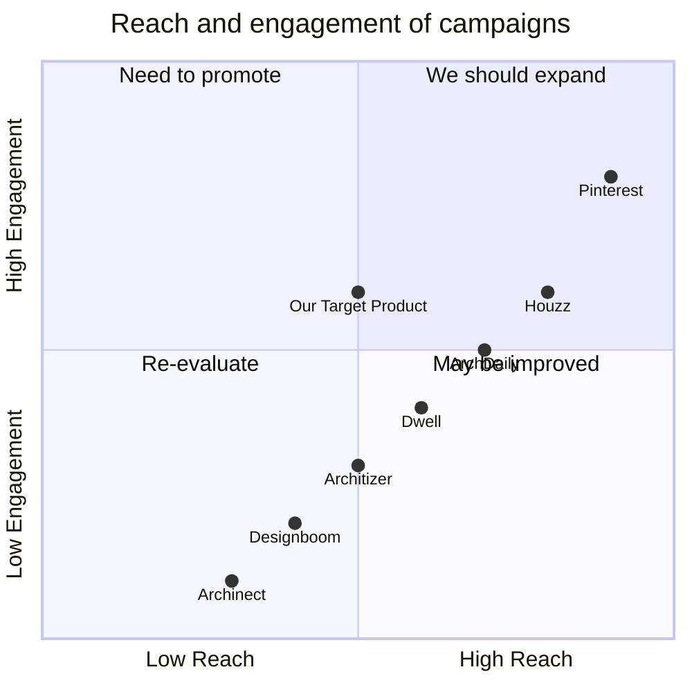

## Original Requirements
The boss has requested for the design of a content website for architects. The website should be similar to Pinterest with images generated by AIGC. The code for the website should be written by an engineer.

## Product Goals
```python
[
    "Create a user-friendly content website for architects",
    "Incorporate AIGC-generated images into the website",
    "Ensure the website is similar in functionality and design to Pinterest"
]
```

## User Stories
```python
[
    "As an architect, I want to browse through a variety of AIGC-generated images to find inspiration for my projects",
    "As a user, I want to be able to save images I like to my personal board for future reference",
    "As a user, I want to be able to search for specific types of architectural designs",
    "As a user, I want to be able to upload my own images and share them with the community",
    "As a user, I want to interact with other users by commenting on and liking their posts"
]
```

## Competitive Analysis
```python
[
    "Pinterest: A well-known platform for sharing and discovering new ideas. It has a user-friendly interface and a large user base, but it doesn't focus specifically on architecture",
    "ArchDaily: A website dedicated to architecture, but it lacks the social and interactive aspects of Pinterest",
    "Houzz: A platform for home renovation and design, providing a unique blend of products, pros, and inspiration. However, it's more focused on interior design than architecture",
    "Dwell: A platform for discovering modern architecture and design, but it doesn't allow users to upload their own content",
    "Architizer: A platform for architects to showcase their work, but it lacks the user-friendly interface of Pinterest",
    "Designboom: An online architecture magazine, but it doesn't have the interactive features of a social platform",
    "Archinect: A platform for architects to connect and share their work, but it doesn't have the visual appeal of Pinterest"
]
```

## Competitive Quadrant Chart


## Requirement Analysis
The product should be a content website for architects, similar to Pinterest. It should allow users to browse, save, and upload images, as well as interact with other users. The images on the website should be generated by AIGC.

## Requirement Pool
```python
[
    ("Implement a user-friendly interface similar to Pinterest", "P0"),
    ("Incorporate AIGC-generated images into the website", "P0"),
    ("Allow users to save images to their personal board", "P0"),
    ("Include a search function for users to find specific types of architectural designs", "P1"),
    ("Enable users to upload their own images and share them with the community", "P1"),
    ("Include interactive features for users to comment on and like posts", "P2")
]
```

## UI Design draft
The website should have a clean, minimalist design with a focus on the images. The homepage should display a grid of images, with options to filter and sort them. Each image should have a button to save it to the user's personal board. There should also be a search bar at the top of the page for users to find specific types of designs. The user's personal board and uploaded images should be accessible from a menu bar at the top of the page.

## Anything UNCLEAR
There are no unclear points.