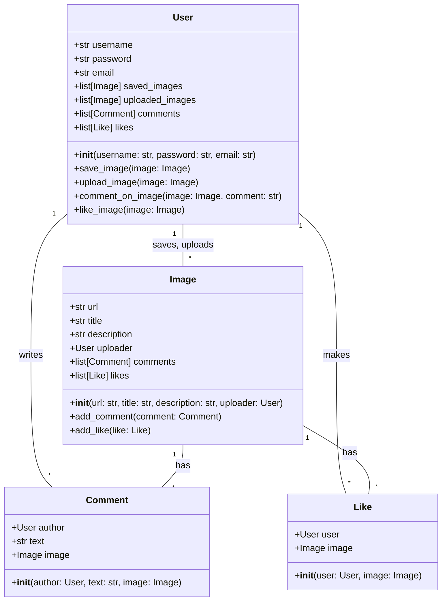
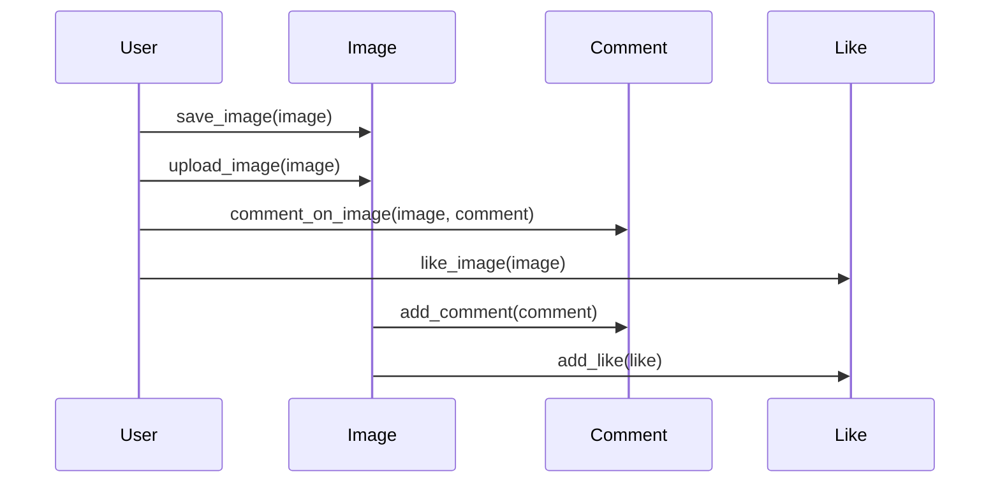

## Implementation approach
The website will be built using the Django framework due to its robustness and scalability. Django has a user-friendly admin interface which can be used for managing the content of the website. For the front-end, we will use Bootstrap to achieve a responsive and user-friendly interface similar to Pinterest. 

To incorporate AIGC-generated images, we will use an open-source AI image generation library such as DeepArt or DeepDream. These images will be stored in a PostgreSQL database due to its excellent performance with large datasets. 

For user interactions such as saving images, commenting, and liking posts, we will use Django's built-in authentication and authorization modules. 

The search functionality will be implemented using Elasticsearch, an open-source search engine that provides a distributed, multitenant-capable full-text search engine with an HTTP web interface and schema-free JSON documents.

## Python package name
```python
"architects_inspiration"
```

## File list
```python
[
    "main.py",
    "settings.py",
    "urls.py",
    "models.py",
    "views.py",
    "forms.py",
    "templates/home.html",
    "templates/board.html",
    "templates/search.html",
    "templates/upload.html",
    "static/css/main.css",
    "static/js/main.js",
    "requirements.txt"
]
```

## Data structures and interface definitions


## Program call flow


## Anything UNCLEAR
The requirement is clear to me.