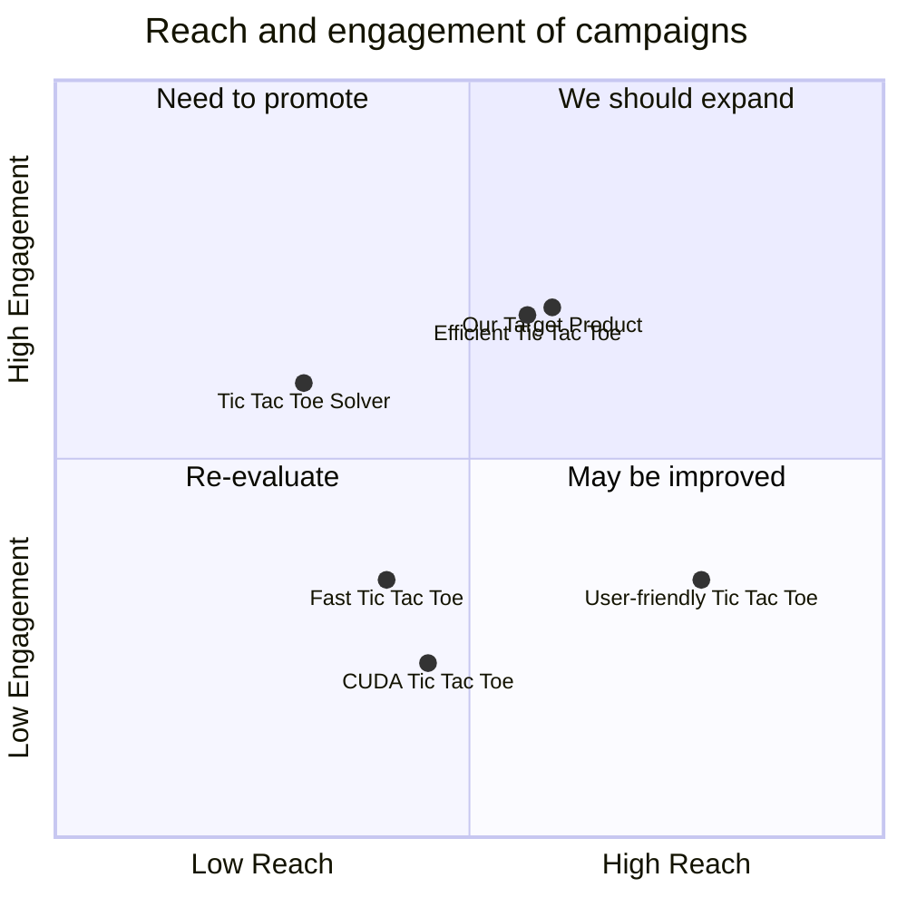

## Original Requirements
The boss has tasked us with designing a software product that can solve Tic Tac Toe using CUDA. The code for this product should be written by an engineer.

## Product Goals
```python
[
    "Create a software product that can solve Tic Tac Toe using CUDA",
    "Ensure the product is efficient and user-friendly",
    "The product should be able to solve the game in the least amount of moves possible"
]
```

## User Stories
```python
[
    "As a user, I want to be able to input my own Tic Tac Toe game state and have the software solve it",
    "As a user, I want the software to solve the game in the least amount of moves possible",
    "As a user, I want to be able to understand how the software is solving the game",
    "As a user, I want the software to be easy to use and intuitive",
    "As a user, I want the software to be fast and efficient"
]
```

## Competitive Analysis
```python
[
    "Tic Tac Toe Solver: A simple software that solves Tic Tac Toe but does not use CUDA",
    "CUDA Tic Tac Toe: A software that uses CUDA to solve Tic Tac Toe but lacks a user-friendly interface",
    "Efficient Tic Tac Toe: A software that solves Tic Tac Toe efficiently but does not use CUDA",
    "User-friendly Tic Tac Toe: A software that is user-friendly but does not solve the game in the least amount of moves possible",
    "Fast Tic Tac Toe: A software that solves the game quickly but does not use CUDA or have a user-friendly interface"
]
```

## Competitive Quadrant Chart


## Requirement Analysis
The product should be a software that can solve Tic Tac Toe using CUDA. It should be user-friendly, efficient, and able to solve the game in the least amount of moves possible. The code for this product should be written by an engineer.

## Requirement Pool
```python
[
    ("The software should be able to solve Tic Tac Toe using CUDA", "P0"),
    ("The software should be user-friendly", "P0"),
    ("The software should be efficient", "P0"),
    ("The software should solve the game in the least amount of moves possible", "P0"),
    ("The code for the software should be written by an engineer", "P0")
]
```

## UI Design draft
The software should have a simple and intuitive interface. It should have an input field where users can enter the game state of Tic Tac Toe. Once the game state is entered, the software should display the solution in a clear and understandable manner. The layout should be clean and uncluttered, with a focus on functionality and ease of use.

## Anything UNCLEAR
There are no unclear points.