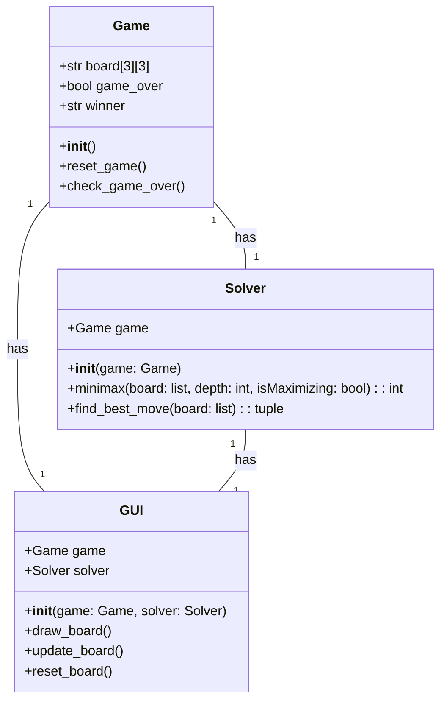
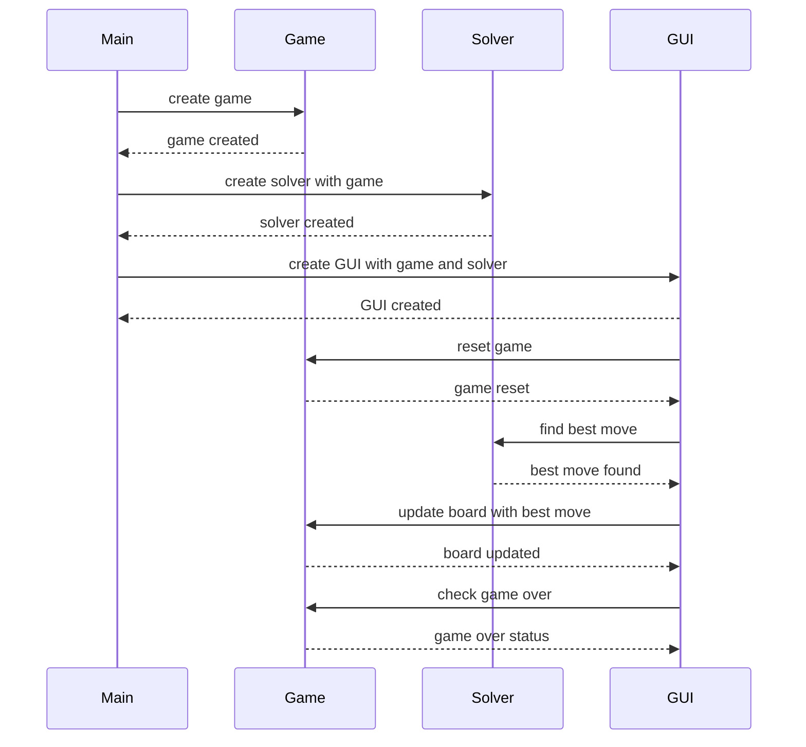

## Implementation approach
We will use Python as our main programming language due to its simplicity and wide range of libraries. For the CUDA implementation, we will use PyCUDA, an open-source Python wrapper for CUDA programming. The game logic will be implemented using standard Python libraries. The user interface will be created using Tkinter, a Python binding to the Tk GUI toolkit. The software will use a minimax algorithm to solve the game in the least amount of moves possible. The difficult point in the requirement is the CUDA implementation, but PyCUDA provides a Pythonic interface to CUDA which simplifies the process.

## Python package name
```python
"cuda_tictactoe_solver"
```

## File list
```python
[
    "main.py",
    "game_logic.py",
    "solver.py",
    "gui.py"
]
```

## Data structures and interface definitions


## Program call flow


## Anything UNCLEAR
The requirement is clear to me.