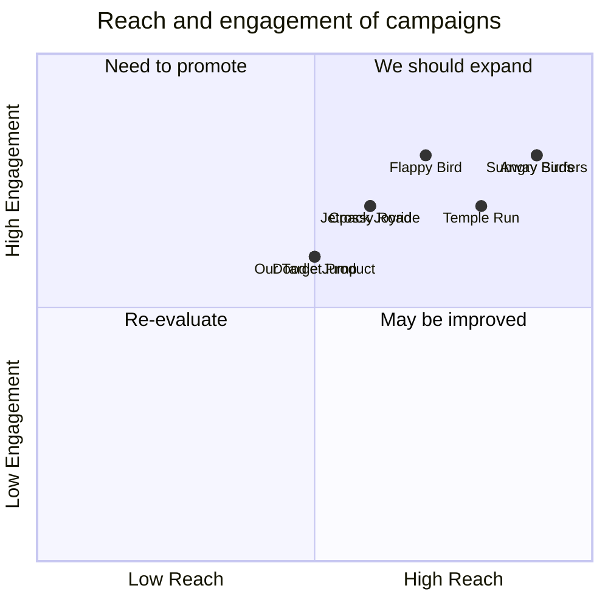

## Original Requirements
The boss has asked to design the software for a flapping bird game. The software should be coded by an engineer.

## Product Goals
```python
[
    "Create a simple, engaging flapping bird game",
    "Ensure the game is easy to understand and play",
    "Design the game to be visually appealing"
]
```

## User Stories
```python
[
    "As a user, I want to easily understand the game rules so I can start playing quickly",
    "As a user, I want the game to be challenging so that I am motivated to improve",
    "As a user, I want to be able to see my high scores so I can track my progress",
    "As a user, I want the game to have a pleasing aesthetic so I enjoy playing",
    "As a user, I want the game to run smoothly without any glitches or lags"
]
```

## Competitive Analysis
```python
[
    "Flappy Bird: The original game, simple controls but very challenging",
    "Crossy Road: Similar endless runner style, with more complex graphics and gameplay",
    "Angry Birds: Different mechanics but similar bird theme, more complex gameplay",
    "Doodle Jump: Similar endless runner style, with different mechanics",
    "Jetpack Joyride: Similar endless runner style, with more complex graphics and gameplay",
    "Temple Run: Similar endless runner style, with 3D graphics and more complex gameplay",
    "Subway Surfers: Similar endless runner style, with 3D graphics and more complex gameplay"
]
```

## Competitive Quadrant Chart


## Requirement Analysis
The product should be a flapping bird game. The game should be simple to understand and play, but also provide a level of challenge to keep players engaged. The game should have a visually pleasing aesthetic and run smoothly without any glitches or lags.

## Requirement Pool
```python
[
    ("Design a simple, engaging flapping bird game", "P0"),
    ("Ensure the game is easy to understand and play", "P0"),
    ("Design the game to be visually appealing", "P1"),
    ("Implement a high score system", "P1"),
    ("Ensure the game runs smoothly without glitches or lags", "P0")
]
```

## UI Design draft
The game will have a simple, clean design with a single bird character that the player controls. The bird will be in the center of the screen, with obstacles coming from the right side of the screen that the player must avoid. The score will be displayed at the top of the screen. The game will have a bright, colorful aesthetic to make it visually appealing.

## Anything UNCLEAR
There are no unclear points.