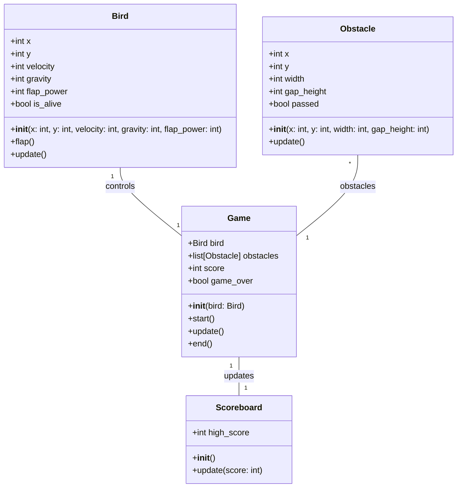
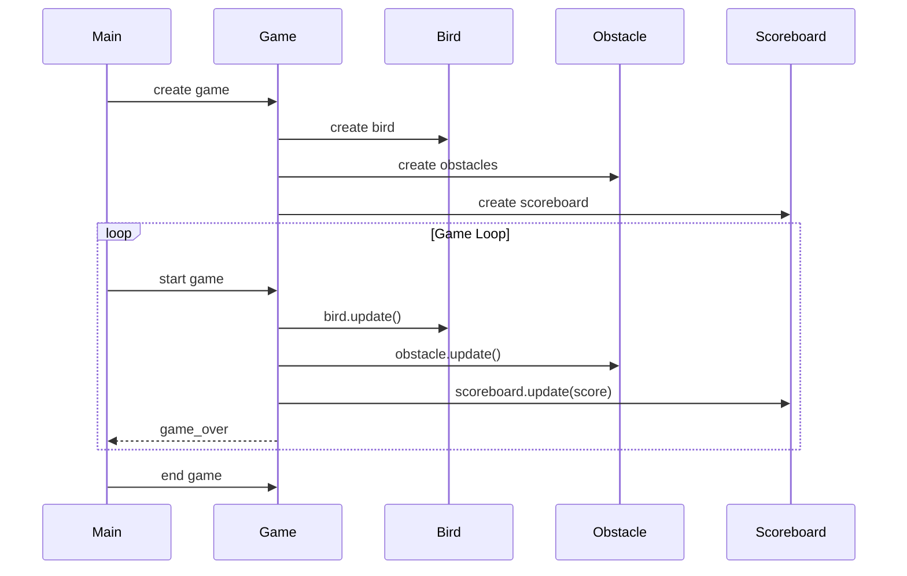

## Implementation approach
We will use Pygame, an open-source Python library for making video games. It is designed to be simple to use, yet powerful enough to allow for complex game development. Pygame provides modules for handling graphics, sound, input, and more, making it a good fit for our flapping bird game. 

The game will be designed as a single-player game where the player controls a bird trying to fly through gaps in incoming obstacles. The bird will be controlled by the space bar, which will make the bird flap and rise. The bird will automatically descend if the space bar is not pressed. 

The game will end if the bird touches an obstacle or the ground. The score will be determined by the number of obstacles the player successfully navigates through.

## Python package name
```python
"flappy_bird_game"
```

## File list
```python
[
    "main.py",
    "bird.py",
    "obstacle.py",
    "game.py",
    "constants.py",
    "scoreboard.py"
]
```

## Data structures and interface definitions


## Program call flow


## Anything UNCLEAR
The requirement is clear to me.