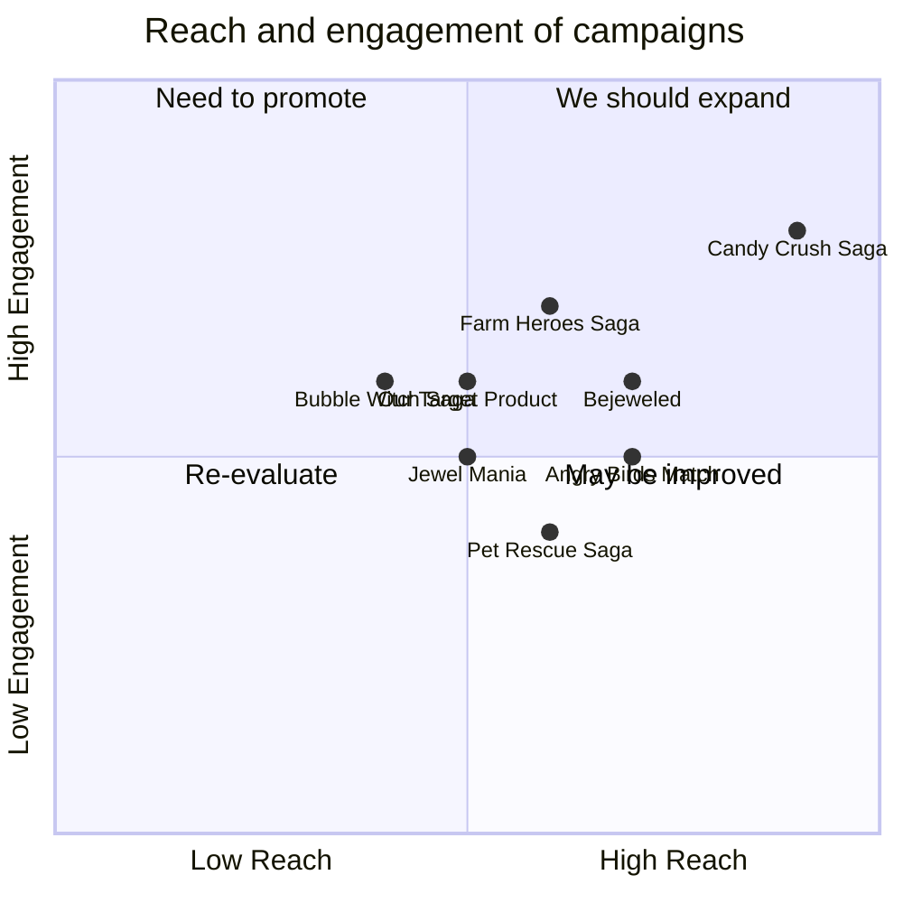

## Original Requirements
The boss has requested the creation of a game similar to Candy Crush. The game should be developed by an engineer.

## Product Goals
```python
[
    "Create a fun and addictive match-3 game",
    "Ensure the game is easy to understand and play",
    "Develop a game with a variety of levels and challenges"
]
```

## User Stories
```python
[
    "As a user, I want to be able to easily understand the game rules so I can start playing quickly",
    "As a user, I want to be challenged by different levels so I can continue to enjoy the game",
    "As a user, I want to be able to progress through the game and unlock new levels",
    "As a user, I want to be able to compete with my friends and see their scores",
    "As a user, I want the game to be visually appealing and fun to play"
]
```

## Competitive Analysis
```python
[
    "Candy Crush Saga: The original match-3 game with a large user base and variety of levels",
    "Bejeweled: Another popular match-3 game with different game modes",
    "Farm Heroes Saga: A match-3 game from the makers of Candy Crush with a farming theme",
    "Jewel Mania: A match-3 game with hundreds of fun levels",
    "Bubble Witch Saga: A game from the makers of Candy Crush where players match bubbles instead of candies",
    "Pet Rescue Saga: Another game from the makers of Candy Crush where players match blocks to rescue pets",
    "Angry Birds Match: A match-3 game from the creators of Angry Birds with a bird theme"
]
```

## Competitive Quadrant Chart


## Requirement Analysis
The product should be a match-3 game similar to Candy Crush. It should be easy to understand and play, with a variety of levels and challenges to keep the user engaged. The game should also have a social aspect, allowing users to compete with their friends and see their scores.

## Requirement Pool
```python
[
    ("Develop a match-3 game mechanic", "P0"),
    ("Create a variety of levels and challenges", "P0"),
    ("Implement a scoring system", "P0"),
    ("Add a social feature for users to compete with friends", "P1"),
    ("Design a visually appealing game interface", "P1")
]
```

## UI Design draft
The game interface should be colorful and engaging, with a clear display of the game board, score, and level. The game board should be in the center of the screen, with the score and level displayed at the top. There should also be a menu button for users to access settings, view their progress, and compete with friends.

## Anything UNCLEAR
There are no unclear points.