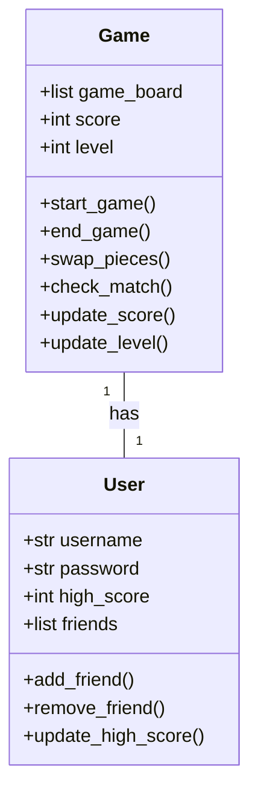
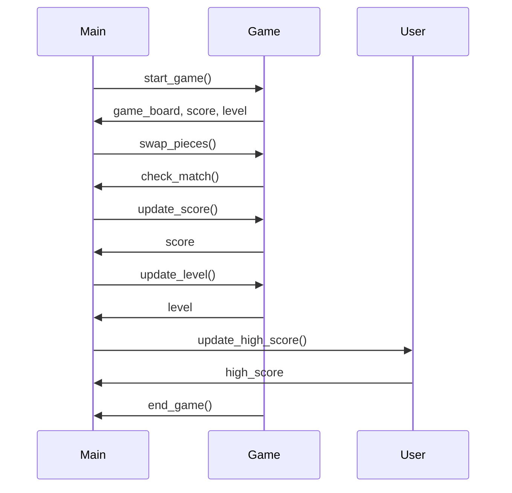

## Implementation approach
We will use Pygame, an open-source library designed for making video games in Python. Pygame is highly portable and runs on almost every platform and operating system. It's also beginner-friendly and has a strong community. 

The game will be designed with a Model-View-Controller (MVC) architecture. The Model will handle the game logic, the View will handle the game's graphical interface, and the Controller will handle user input.

The game logic will include the match-3 mechanic, scoring system, and level progression. The graphical interface will display the game board, score, and level. The user input will include mouse clicks for swapping game pieces.

We will also use SQLite for storing user data, such as scores and progress, and Flask for the social feature, allowing users to compete with their friends.

## Python package name
```python
"match_three_game"
```

## File list
```python
[
    "main.py",
    "model.py",
    "view.py",
    "controller.py",
    "database.py",
    "social.py"
]
```

## Data structures and interface definitions


## Program call flow


## Anything UNCLEAR
The requirement is clear to me.