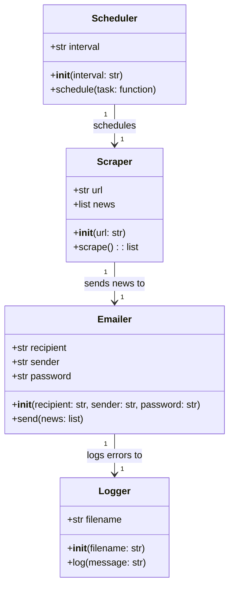
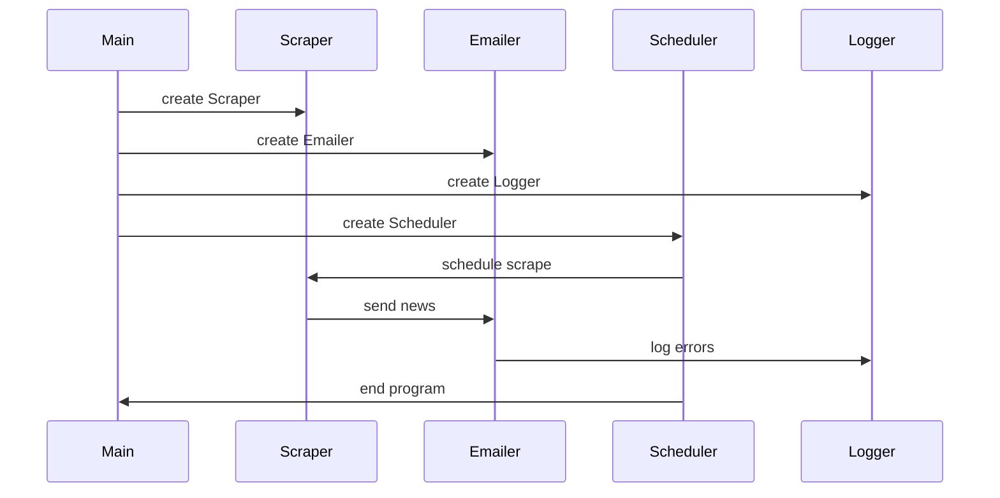

## Implementation approach
The system will be implemented as a Python script that uses BeautifulSoup for web scraping and smtplib for sending emails. The script will be scheduled to run at regular intervals using the schedule library. The script will first scrape the latest technology news from the donews platform, then send the news to the specified email address. If any errors or exceptions occur during the process, they will be logged using the logging library and the user will be notified.

## Python package name
```python
"news_scraper"
```

## File list
```python
[
    "main.py",
    "scraper.py",
    "emailer.py",
    "scheduler.py",
    "logger.py"
]
```

## Data structures and interface definitions


## Program call flow


## Anything UNCLEAR
The requirement is clear to me.