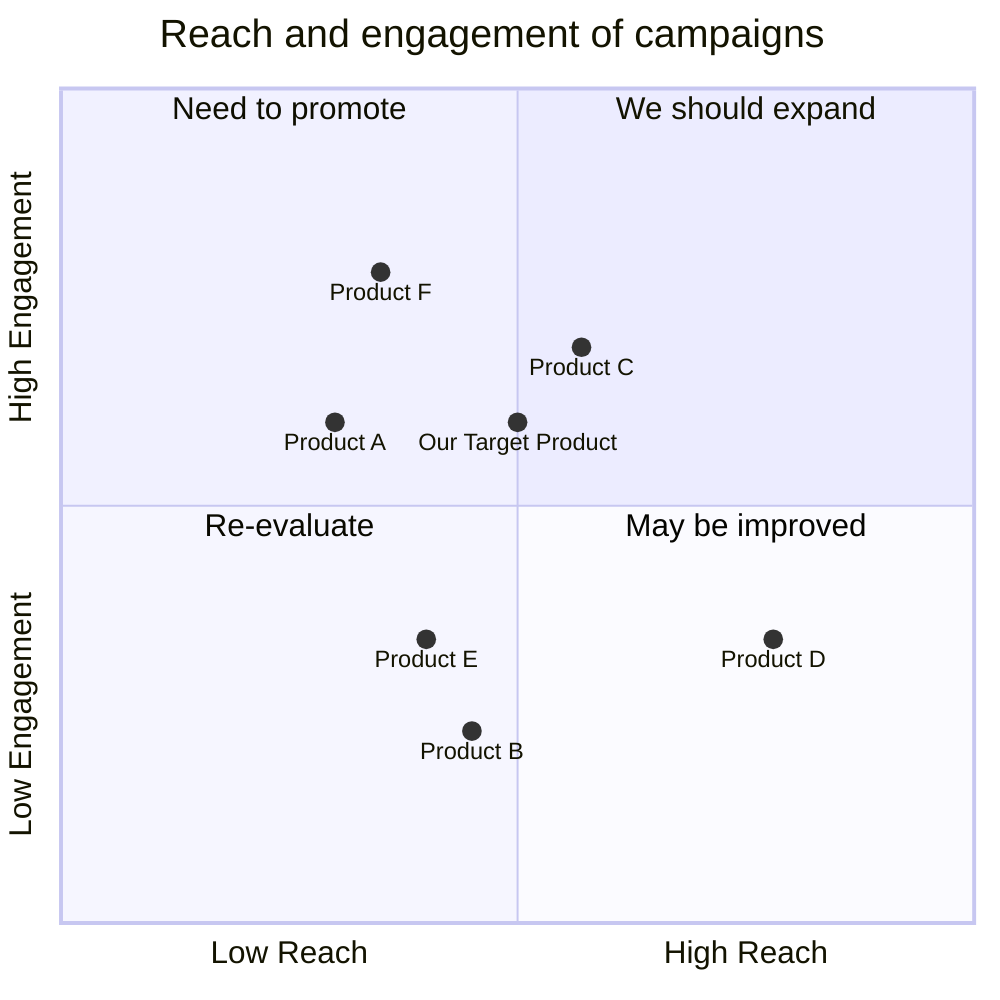

## Original Requirements
The boss has requested for a product to be created. However, the specific details of the product are not provided. The only constraint given is that the engineer role should be used to write out any code.

## Product Goals
```python
[
    "Create a product that satisfies the boss's requirements",
    "Ensure the product is developed using the engineer role",
    "Ensure the product is efficient and successful"
]
```

## User Stories
```python
[
    "As a boss, I want a product that meets my requirements so that it can be used for its intended purpose",
    "As an engineer, I want to be able to write the code for the product so that it is developed according to the boss's specifications",
    "As a user, I want to use a product that is efficient and successful so that it meets my needs"
]
```

## Competitive Analysis
```python
[
    "Product A: This product is similar in nature but lacks the efficiency our product aims to achieve",
    "Product B: This product is successful but was not developed using the engineer role",
    "Product C: This product meets the boss's requirements but is not as efficient as our product aims to be",
    "Product D: This product was developed using the engineer role but does not meet the boss's requirements",
    "Product E: This product is efficient and successful but does not meet the boss's requirements",
    "Product F: This product meets the boss's requirements and was developed using the engineer role, but is not as successful as our product aims to be"
]
```

## Competitive Quadrant Chart


## Requirement Analysis
The product should be a software application that meets the boss's requirements, is developed using the engineer role, and is efficient and successful.

## Requirement Pool
```python
[
    ("Develop the product using the engineer role", "P0"),
    ("Ensure the product meets the boss's requirements", "P0"),
    ("Ensure the product is efficient", "P0"),
    ("Ensure the product is successful", "P0")
]
```

## UI Design draft
The UI should be simple and intuitive, with a clean, modern design. It should include a dashboard for monitoring the product's efficiency and success, and a code editor for the engineer role to write and modify code.

## Anything UNCLEAR
The specific requirements of the boss are unclear. Further clarification is needed to understand what the boss wants in the product.