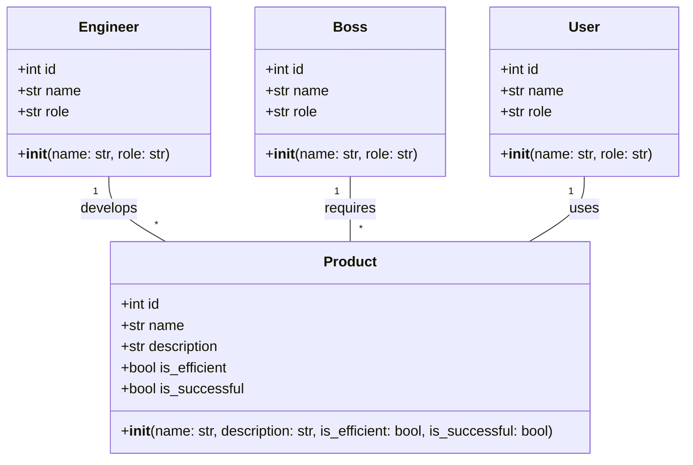
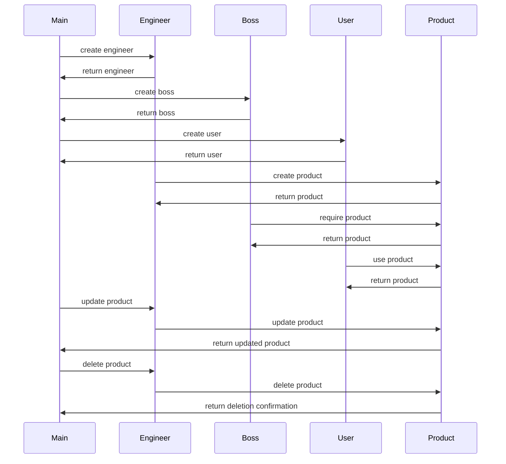

## Implementation approach
The product will be developed using Python, which is a powerful and flexible programming language. We will use Flask, an open-source web framework, for the backend, and SQLite, an open-source database, for data storage. The Flask-SQLAlchemy extension will be used for object-relational mapping (ORM), and Flask-Migrate for database migration tasks. For the frontend, we will use Bootstrap, an open-source CSS framework, and Jinja2 for templates. We will also use pytest for testing, and pylint for code linting to ensure PEP8 compliance.

## Python package name
```python
"product_management_system"
```

## File list
```python
[
    "main.py",
    "config.py",
    "models.py",
    "views.py",
    "forms.py",
    "tests.py",
    "requirements.txt"
]
```

## Data structures and interface definitions


## Program call flow


## Anything UNCLEAR
The requirement is clear to me.