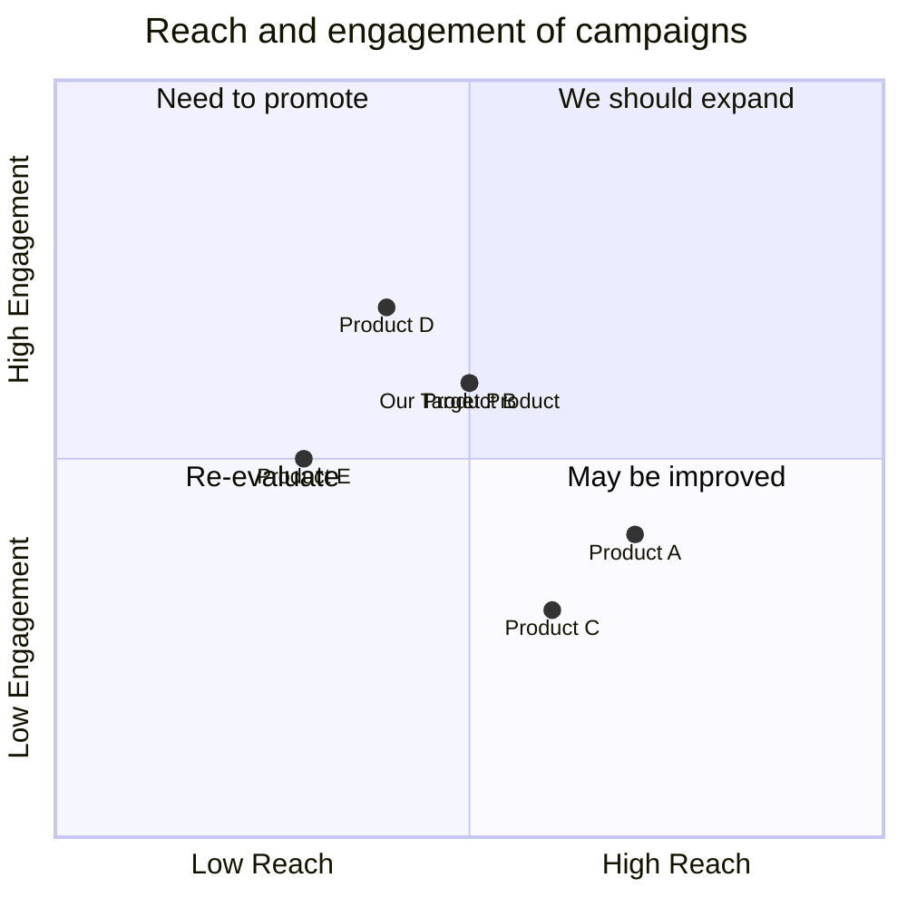

## Original Requirements
The boss has not provided any specific requirements for the product. However, the goal is to efficiently create a successful product.

## Product Goals
```python
[
    "Create a product that meets market needs",
    "Ensure the product is user-friendly and intuitive",
    "Achieve a high level of efficiency in product development"
]
```

## User Stories
```python
[
    "As a user, I want to easily navigate the product so that I can quickly find what I need",
    "As a user, I want the product to be reliable so that I can trust it for my needs",
    "As a user, I want the product to have a clean and modern design so that it is pleasing to use",
    "As a user, I want the product to have a responsive customer service so that my queries and issues are resolved quickly",
    "As a user, I want the product to be regularly updated so that it stays relevant and useful"
]
```

## Competitive Analysis
```python
[
    "Product A: A similar product with a strong market presence, but has a complex interface",
    "Product B: A competitor with a sleek design, but lacks in customer service",
    "Product C: A product with great customer service, but falls short in regular updates",
    "Product D: A product with a strong user base, but has reliability issues",
    "Product E: A product with efficient development cycles, but lacks in meeting market needs"
]
```

## Competitive Quadrant Chart


## Requirement Analysis
The product should be user-friendly, reliable, and efficient. It should meet the market needs and have a modern design. It should also have a responsive customer service and be regularly updated.

## Requirement Pool
```python
[
    ("Develop a user-friendly and intuitive interface", "P0"),
    ("Ensure the product is reliable and trustworthy", "P0"),
    ("Create a modern and clean design for the product", "P1"),
    ("Establish a responsive customer service", "P1"),
    ("Set up regular updates for the product", "P2")
]
```

## UI Design draft
The product will have a clean and modern design with easy navigation. The main features will be prominently displayed on the home screen. The color scheme will be soothing to the eyes. The layout will be intuitive, with clear labels for all features and functions.

## Anything UNCLEAR
There are no unclear points.