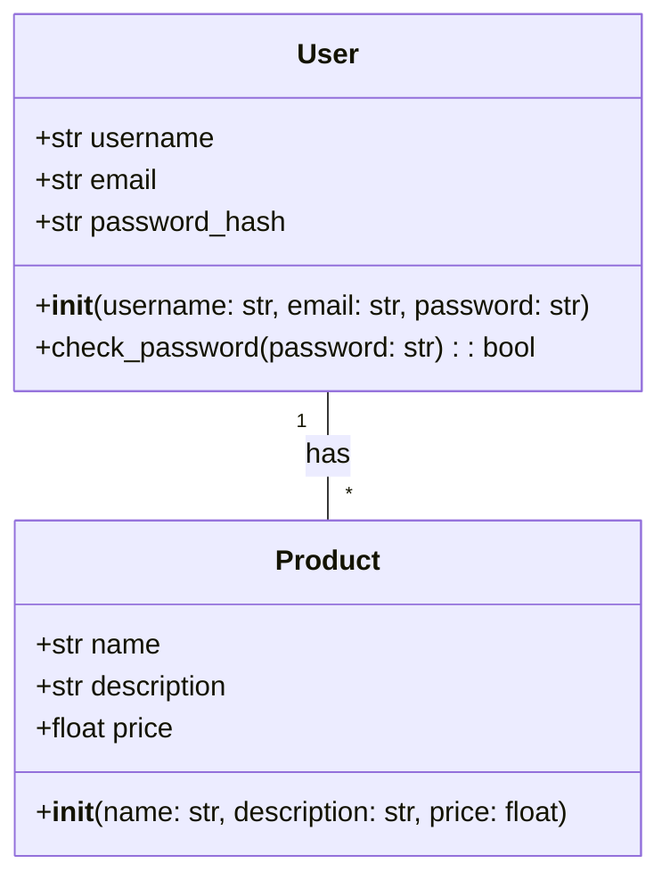
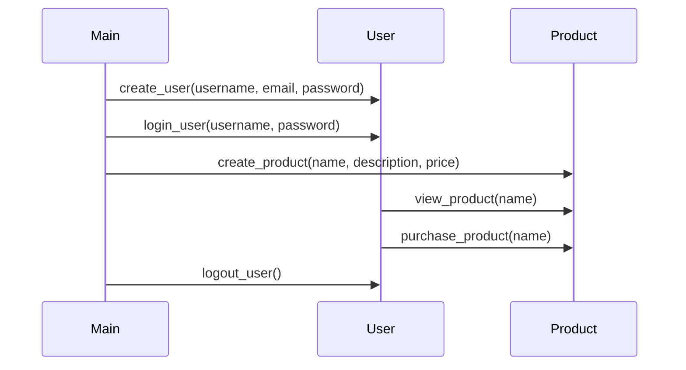

## Implementation approach
We will use Flask, an open-source Python web framework, to develop the backend of our product. Flask is lightweight and easy to use, making it ideal for creating a user-friendly and intuitive interface. For the frontend, we will use Bootstrap, an open-source CSS framework, to create a modern and clean design. We will use SQLite for the database to ensure the product is reliable and trustworthy. For customer service, we will integrate an open-source live chat software like LiveHelperChat. We will use Docker for deployment to ensure efficient development and easy updates.

## Python package name
```python
"product_x"
```

## File list
```python
[
    "main.py",
    "app/__init__.py",
    "app/routes.py",
    "app/models.py",
    "app/forms.py",
    "app/static/css/style.css",
    "app/templates/index.html",
    "app/templates/layout.html",
    "app/templates/login.html",
    "app/templates/register.html",
    "config.py",
    "Dockerfile",
    "requirements.txt"
]
```

## Data structures and interface definitions


## Program call flow


## Anything UNCLEAR
The requirement is clear to me.