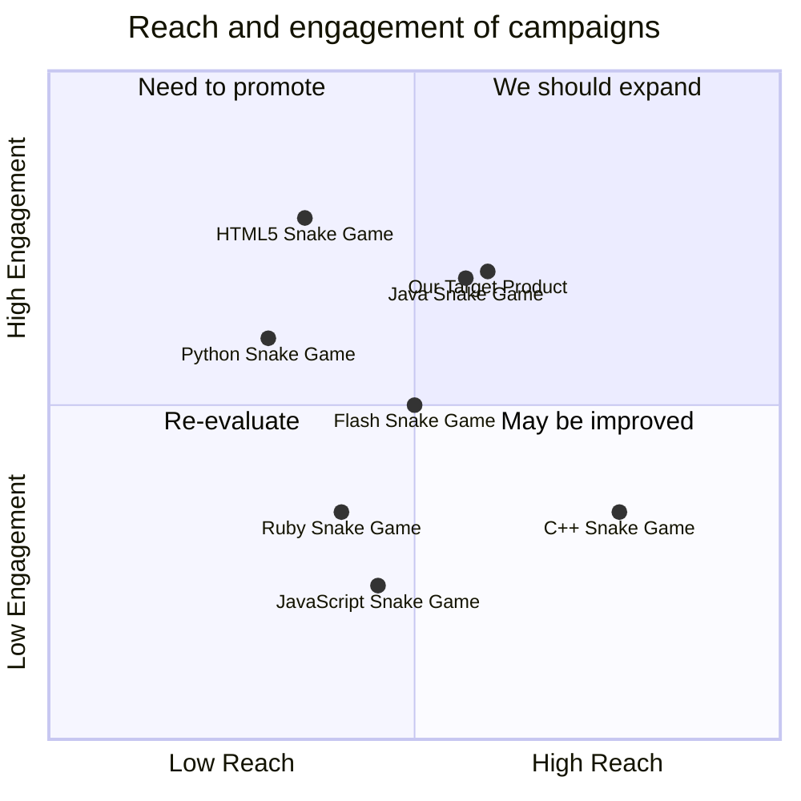

## Original Requirements
The boss has instructed to design the software of a fun snake game in Python. The code for the game should be written by an engineer.

## Product Goals
```python
[
    "Create a fun and engaging snake game in Python",
    "Ensure the game is easy to understand and play",
    "The game should run smoothly without any glitches"
]
```

## User Stories
```python
[
    "As a user, I want to be able to easily start a new game",
    "As a user, I want the game to respond quickly to my commands",
    "As a user, I want to see my high score and try to beat it",
    "As a user, I want the game to get progressively harder as I play",
    "As a user, I want to be able to pause and resume the game"
]
```

## Competitive Analysis
```python
[
    "Python Snake Game: Simple and easy to play, but lacks advanced features",
    "JavaScript Snake Game: More features and better graphics, but not as responsive",
    "Java Snake Game: Good balance of features and responsiveness, but complex code",
    "C++ Snake Game: Fast and responsive, but lacks user-friendly interface",
    "Ruby Snake Game: Easy to understand code, but game is too simple",
    "HTML5 Snake Game: Good graphics and features, but slower response times",
    "Flash Snake Game: Smooth gameplay and good features, but requires Flash player"
]
```

## Competitive Quadrant Chart


## Requirement Analysis
The product should be a fun and engaging snake game developed in Python. It should be easy to play with a user-friendly interface. The game should respond quickly to user commands and run smoothly without any glitches. It should also include features like high score tracking, progressive difficulty, and the ability to pause and resume the game.

## Requirement Pool
```python
[
    ("Develop the basic game mechanics", "P0"),
    ("Implement a user-friendly interface", "P0"),
    ("Add high score tracking feature", "P1"),
    ("Add progressive difficulty feature", "P1"),
    ("Add pause and resume feature", "P2")
]
```

## UI Design draft
The game will have a simple and clean interface. The game area will be in the center of the screen with the score displayed at the top. The controls will be displayed at the bottom of the screen. The game will have a retro, pixelated style to evoke nostalgia.

## Anything UNCLEAR
There are no unclear points.