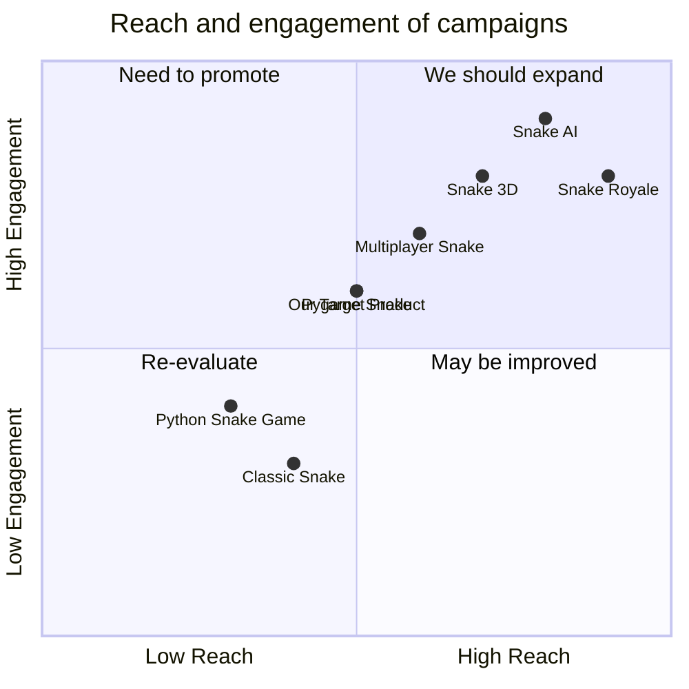

## Original Requirements
The boss has asked for a software product for a fun snake game in Python. The game should be coded by an engineer.

## Product Goals
```python
[
    "Create an engaging and fun snake game in Python",
    "Ensure the game is easy to understand and play",
    "The game should have a high replay value"
]
```

## User Stories
```python
[
    "As a user, I want to be able to easily start a new game so that I can play whenever I want",
    "As a user, I want the game to be challenging so that I can improve my skills",
    "As a user, I want to be able to pause and resume the game so that I can take breaks",
    "As a user, I want to be able to see my high score so that I can track my progress",
    "As a user, I want the game to have smooth controls so that I can enjoy playing"
]
```

## Competitive Analysis
```python
[
    "Python Snake Game: A simple snake game with basic functionality and controls",
    "Pygame Snake: A more advanced snake game with additional features and better graphics",
    "Snake 3D: A 3D version of the snake game, providing a unique experience",
    "Classic Snake: A game that replicates the classic snake game found on old mobile phones",
    "Multiplayer Snake: A snake game that allows multiple players to compete against each other",
    "Snake AI: A snake game that includes an AI opponent",
    "Snake Royale: A snake game with battle royale elements"
]
```

## Competitive Quadrant Chart


## Requirement Analysis
The product should be a fun and engaging snake game coded in Python. It should be easy to understand and play, with a high replay value. The game should include features such as the ability to start a new game, pause and resume the game, and see the high score. The controls should be smooth and responsive.

## Requirement Pool
```python
[
    ("Implement basic game functionality including movement and food consumption", "P0"),
    ("Implement a scoring system", "P0"),
    ("Add the ability to pause and resume the game", "P1"),
    ("Add a high score tracking feature", "P1"),
    ("Ensure smooth and responsive controls", "P0")
]
```

## UI Design draft
The game will have a simple and clean interface. The game area will be centered on the screen with the score displayed at the top. The controls will be intuitive, with the arrow keys used for movement. The game will have a modern, minimalist design with a focus on functionality and ease of use.

## Anything UNCLEAR
There are no unclear points.