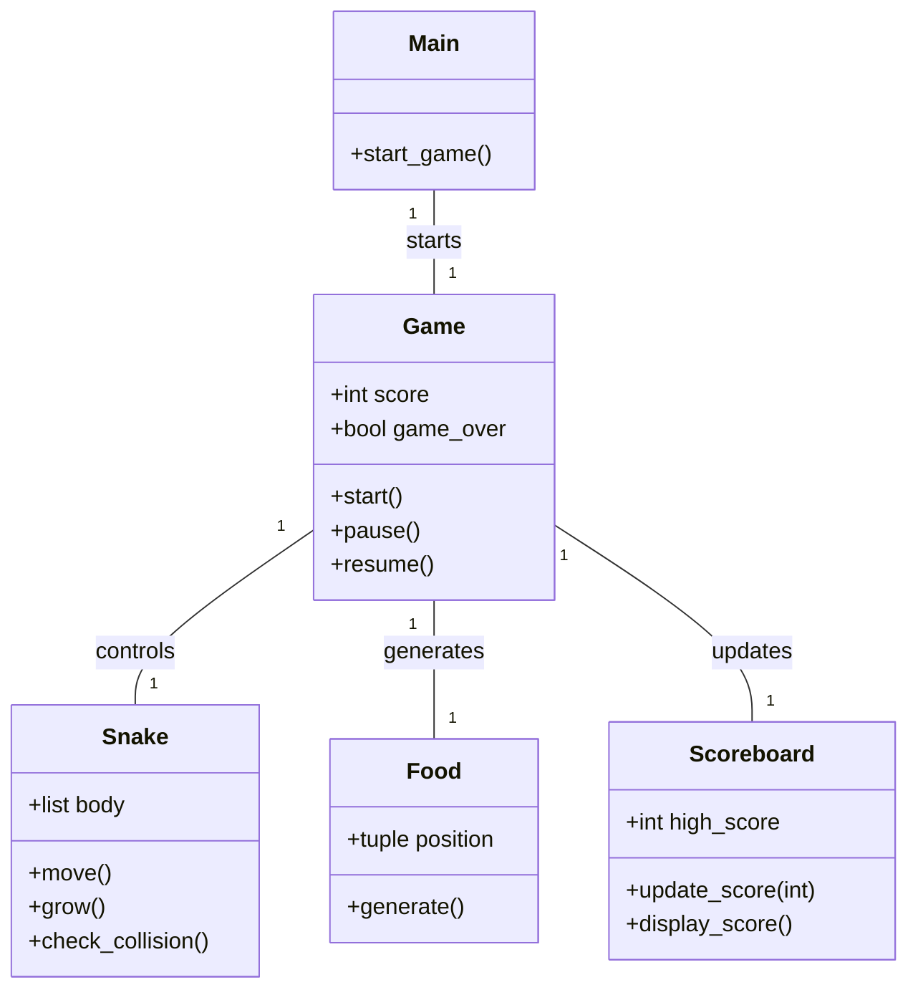
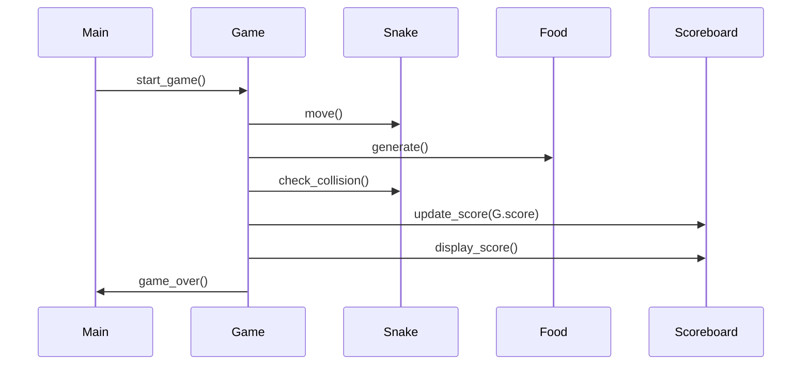

## Implementation approach
We will use Pygame, an open-source library designed for making video games in Python. Pygame is a good choice because it provides functionalities for creating graphical user interfaces and handling events, which are necessary for our game. The difficult points of the requirements are the implementation of the game mechanics and the progressive difficulty feature. For the game mechanics, we will need to handle the movement of the snake and the collision detection with the food and the snake itself. For the progressive difficulty, we will increase the speed of the snake as the score increases.

## Python package name
```python
"py_snake_game"
```

## File list
```python
[
    "main.py",
    "game.py",
    "snake.py",
    "food.py",
    "scoreboard.py"
]
```

## Data structures and interface definitions


## Program call flow


## Anything UNCLEAR
The requirement is clear to me.