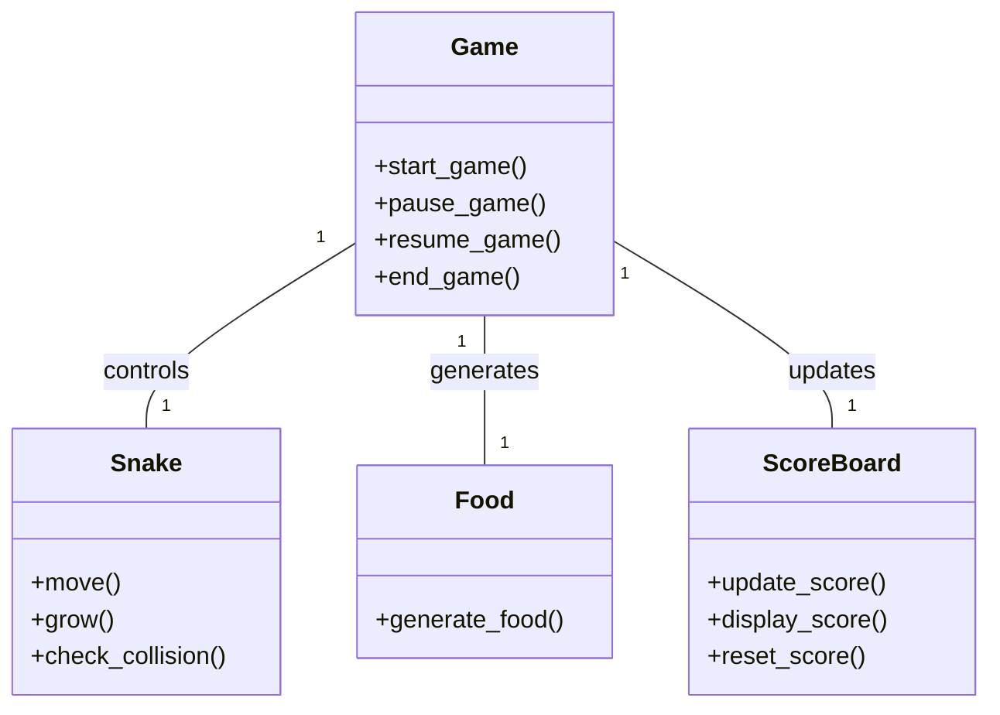
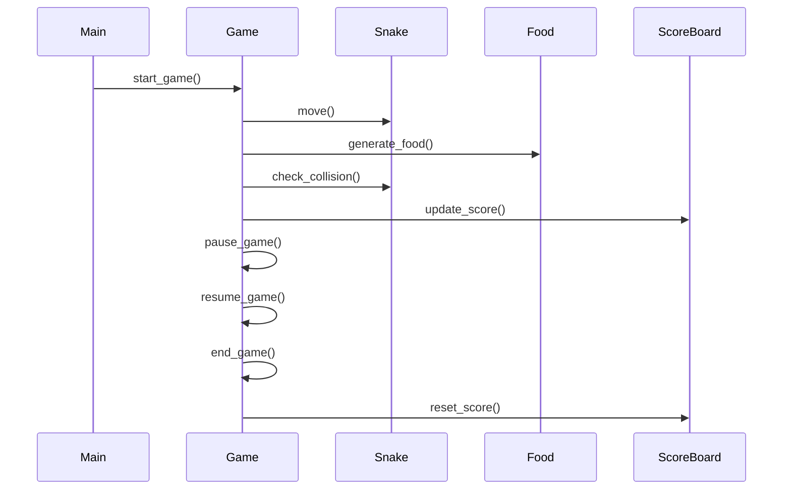

## Implementation approach
We will use the Pygame library, an open-source module for Python, to develop the game. Pygame is a set of Python modules designed for writing video games. It provides functionalities such as graphics, sound, and input handling which are essential for game development. The challenging part of the requirement is to ensure smooth and responsive controls and high replay value. For smooth controls, we will use Pygame's event loop and for high replay value, we will add different levels of difficulty and random placement of food in the game.

## Python package name
```python
"py_snake_game"
```

## File list
```python
[
    "main.py",
    "game.py",
    "snake.py",
    "food.py",
    "scoreboard.py"
]
```

## Data structures and interface definitions


## Program call flow


## Anything UNCLEAR
The requirement is clear to me.