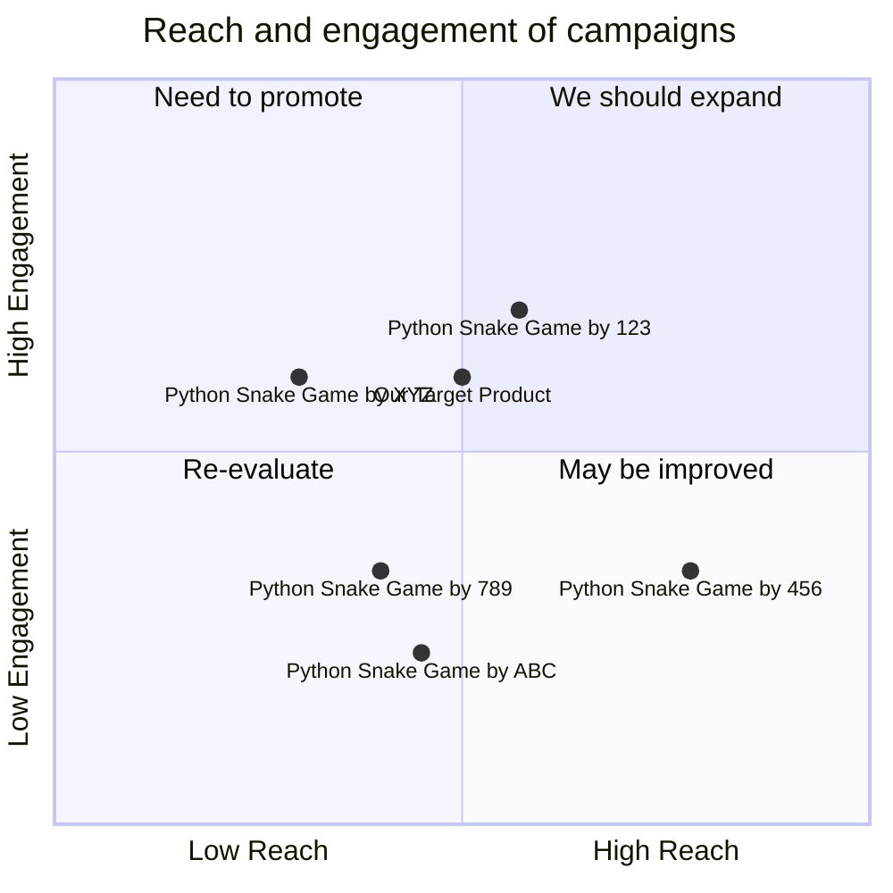

## Original Requirements
The boss has tasked me with designing the software for a fun snake game in Python. The code for this product should be written by an engineer.

## Product Goals
```python
[
    "Create a fun and engaging snake game in Python.",
    "Ensure the game is user-friendly and easy to navigate.",
    "Optimize the game for performance and efficiency."
]
```

## User Stories
```python
[
    "As a user, I want to easily start a new game so that I can play whenever I want.",
    "As a user, I want the game to respond quickly to my inputs so that I can control the snake effectively.",
    "As a user, I want to see my high score so that I can track my progress and aim to beat it.",
    "As a user, I want the game to increase in difficulty as I progress, so that it remains challenging and engaging.",
    "As a user, I want to be able to pause and resume the game, so that I can take breaks when needed."
]
```

## Competitive Analysis
```python
[
    "Python Snake Game by XYZ: Offers a simple and intuitive interface but lacks advanced features.",
    "Python Snake Game by ABC: Has a variety of difficulty levels but the game performance is not optimal.",
    "Python Snake Game by 123: Offers a high score tracking feature but the user interface is not user-friendly.",
    "Python Snake Game by 456: Has a pause and resume feature but the game does not increase in difficulty over time.",
    "Python Snake Game by 789: Offers a responsive game but lacks a high score tracking feature."
]
```

## Competitive Quadrant Chart


## Requirement Analysis
The product should be a snake game designed in Python. It should be fun, engaging, user-friendly, and optimized for performance. The game should respond quickly to user inputs, track high scores, increase in difficulty as the user progresses, and allow the user to pause and resume the game.

## Requirement Pool
```python
[
    ("Develop a user-friendly interface for the game.", "P0"),
    ("Optimize the game for quick response to user inputs.", "P0"),
    ("Implement a feature for tracking high scores.", "P1"),
    ("Ensure the game increases in difficulty as the user progresses.", "P1"),
    ("Add a feature to pause and resume the game.", "P2")
]
```

## UI Design draft
The game interface should be simple and intuitive. It should have a start button to initiate a new game, a display for the current score and high score, and a pause/resume button. The snake and its food should be clearly distinguishable. The layout should be clean and uncluttered, with controls that are easy to understand and use.

## Anything UNCLEAR
There are no unclear points.