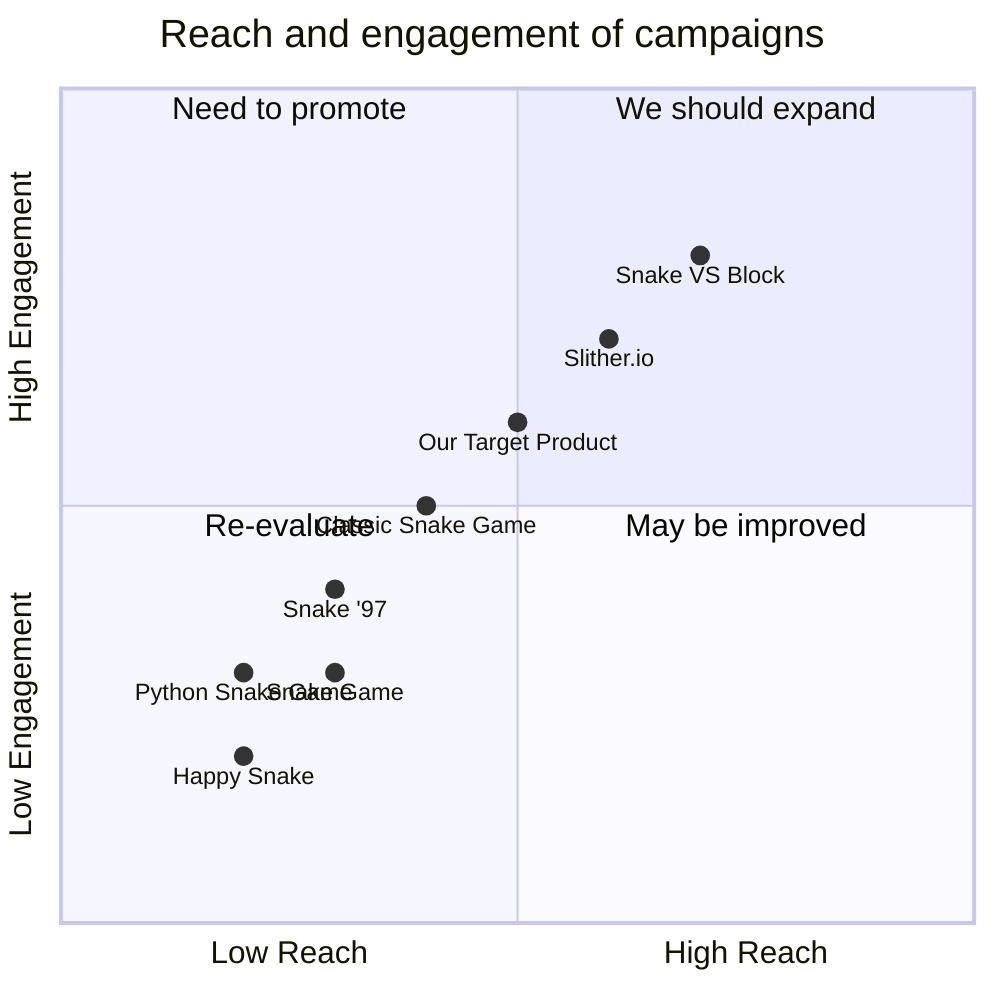

## Original Requirements
The boss has tasked us with designing the software for a fun snake game in Python. The code for the game should be written by an engineer.

## Product Goals
```python
[
    "Create a simple yet engaging snake game in Python",
    "Ensure the game is easy to understand and play",
    "Design the game to be visually appealing"
]
```

## User Stories
```python
[
    "As a user, I want to be able to easily start a new game so I can play whenever I want",
    "As a user, I want the game to get progressively harder so I am always challenged",
    "As a user, I want to be able to pause and resume the game so I can take breaks",
    "As a user, I want to see my high score so I can try to beat it",
    "As a user, I want the game to be visually appealing so I enjoy playing it"
]
```

## Competitive Analysis
```python
[
    "Python Snake Game: Simple design, easy to play, lacks visual appeal",
    "Classic Snake Game: More visually appealing, but more complex to play",
    "Snake '97: Retro design, replicates original snake game, lacks modern features",
    "Slither.io: Multiplayer snake game, more complex, visually appealing",
    "Snake VS Block: Unique twist on snake game, visually appealing, more complex",
    "Happy Snake: Simple, easy to play, lacks challenge",
    "Snake Game: Simple design, lacks visual appeal, easy to play"
]
```

## Competitive Quadrant Chart


## Requirement Analysis
The product should be a simple and engaging snake game designed in Python. It should be easy to understand and play, and visually appealing. The game should get progressively harder and allow users to pause and resume. It should also display the user's high score.

## Requirement Pool
```python
[
    ("Design a simple and engaging snake game in Python", "P0"),
    ("Ensure the game is easy to understand and play", "P0"),
    ("Make the game visually appealing", "P0"),
    ("Include a feature to display the user's high score", "P1"),
    ("Include a feature to pause and resume the game", "P1")
]
```

## UI Design draft
The game should have a simple and clean interface. The main screen should display the game area, score, and controls. The game area should be a grid where the snake moves around. The score should be displayed at the top of the screen. The controls should be intuitive and easy to use, such as arrow keys for movement.

## Anything UNCLEAR
There are no unclear points.