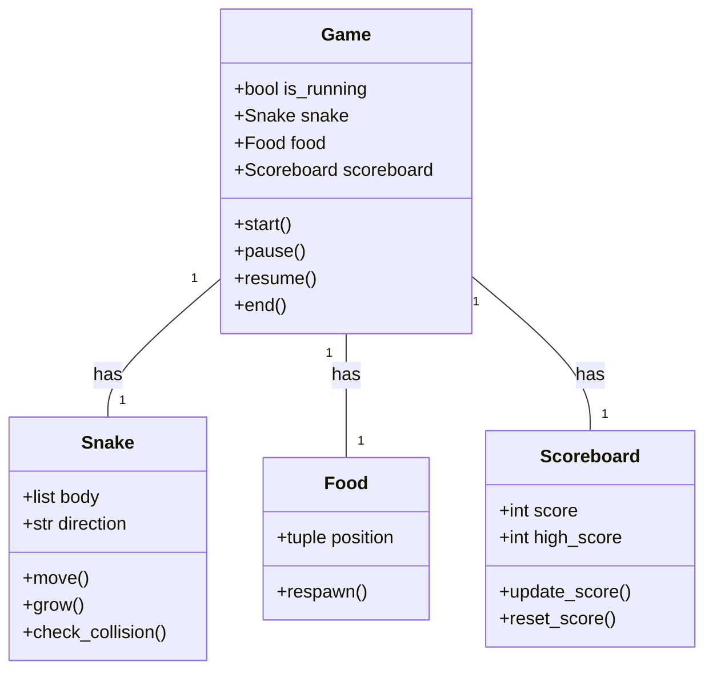

## Implementation approach
We will use Pygame, an open-source Python library designed for making video games, to develop the snake game. Pygame is easy to use and provides functionalities for creating graphical user interfaces, handling events, and managing game states, which are all necessary for our game. The game logic will be encapsulated in classes to ensure modularity and maintainability. The game will be designed to run in a loop, where each iteration represents a frame. The snake's movement, collision detection, score updating, and difficulty adjustment will be handled in each frame. The game will also handle keyboard events for controlling the snake and pausing/resuming the game.

## Python package name
```python
"python_snake_game"
```

## File list
```python
[
    "main.py",
    "game.py",
    "snake.py",
    "food.py",
    "scoreboard.py"
]
```

## Data structures and interface definitions


## Program call flow
```mermaid
sequenceDiagram
    participant M as main
    participant G as Game
    participant S as Snake
    participant F as Food
    participant SB as Scoreboard
    M->>G: create game
    G->>S: create snake
    G->>F: create food
    G->>SB: create scoreboard
    M->>G: start game
    loop game loop
        G->>S: move snake
        G->>S: check collision
        alt collision with food
            G->>F: respawn food
            G->>S: grow snake
            G->>SB: update score
        else collision with self or border
            G->>G: end game
        end
        alt pause game
            M->>G: pause game
            loop pause loop
                alt resume game
                    M->>G: resume game
                    break
                end
            end
        end
    end
    G->>SB: reset score
```

## Anything UNCLEAR
The requirement is clear to me.