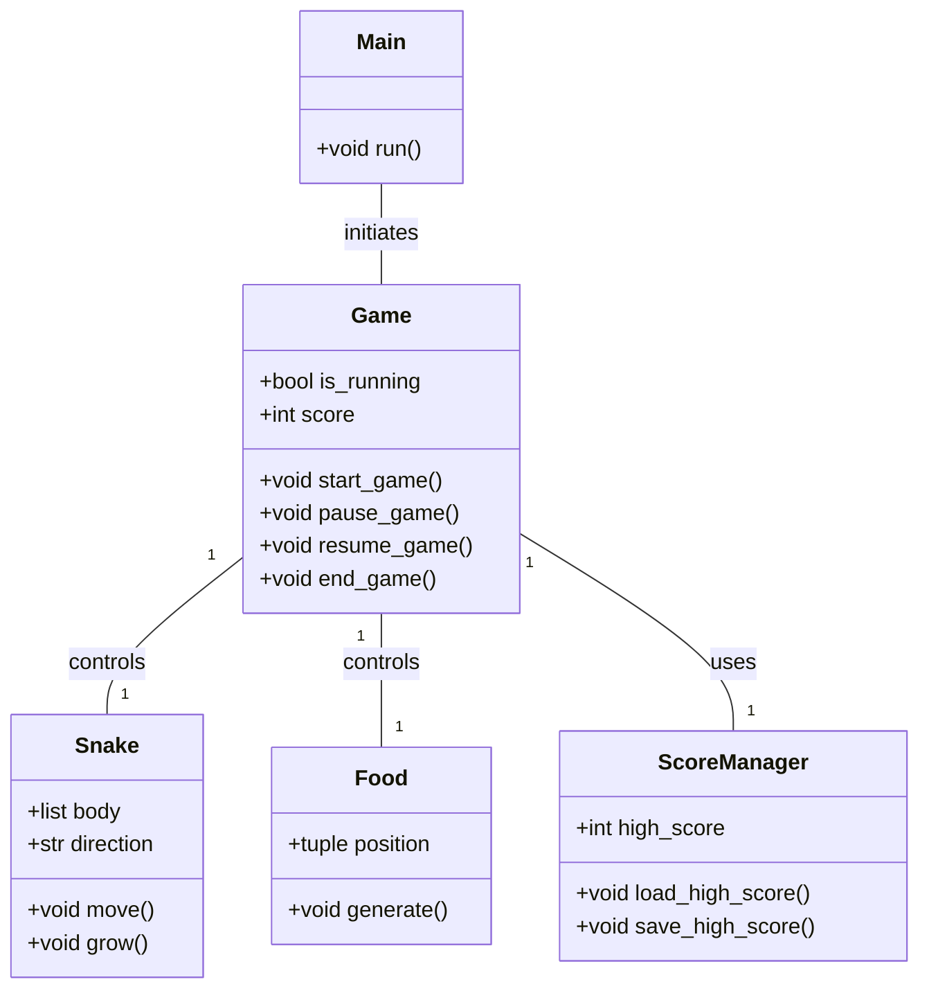
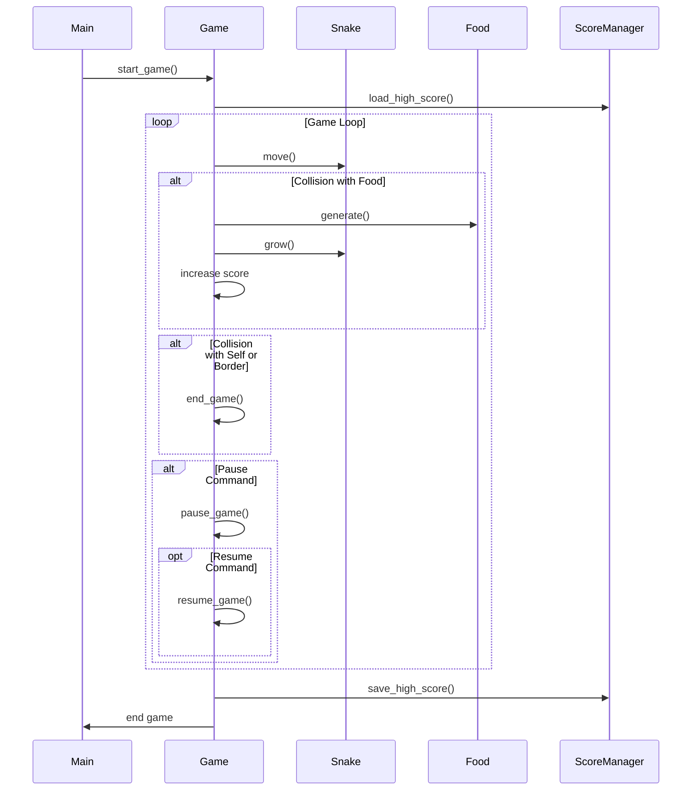

## Implementation approach
The snake game will be implemented using Python's built-in modules and the open-source Pygame library for the game's graphical interface. The game will be designed in an object-oriented manner with classes for the main game, the snake, and the food. The game will progressively get harder by increasing the speed of the snake as the score increases. The game state (paused or running) will be managed using a simple boolean flag. The high score will be stored in a file and loaded each time the game starts.

## Python package name
```python
"python_snake_game"
```

## File list
```python
[
    "main.py",
    "game.py",
    "snake.py",
    "food.py",
    "score_manager.py"
]
```

## Data structures and interface definitions


## Program call flow


## Anything UNCLEAR
The requirement is clear to me.