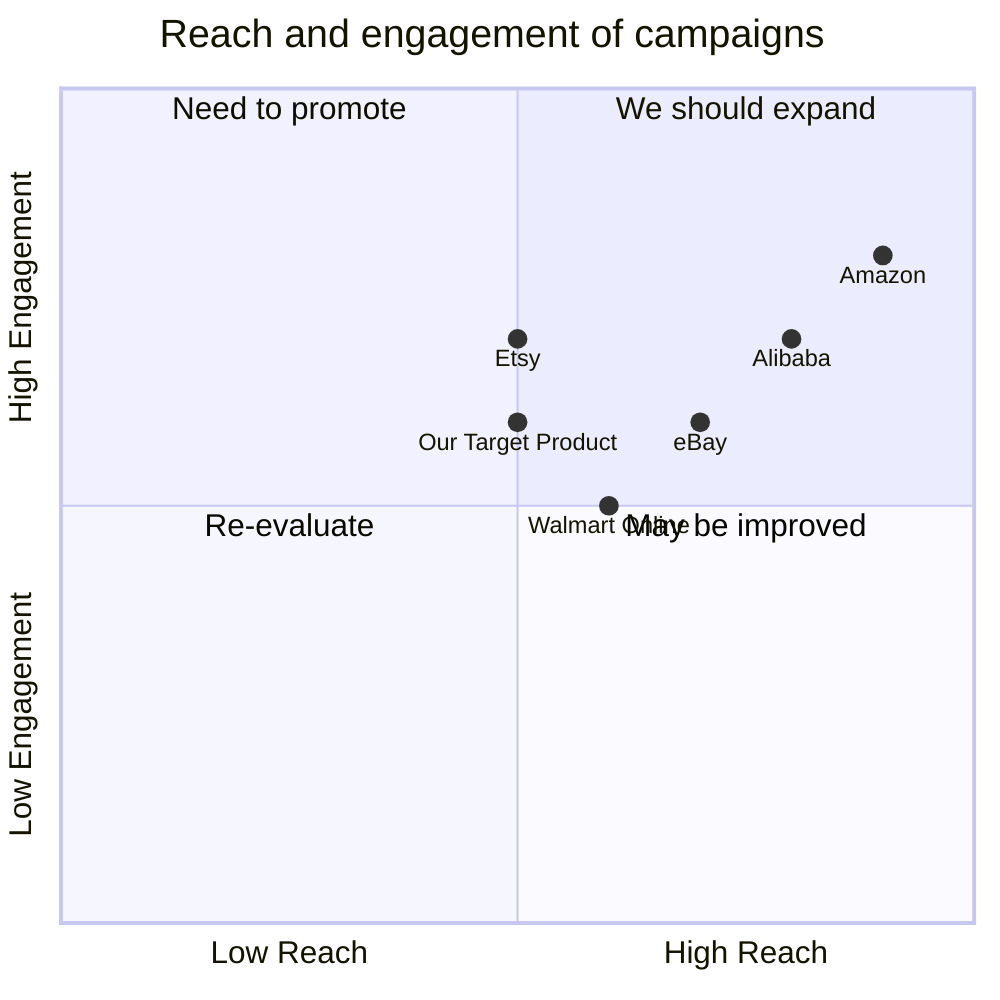

## Original Requirements
The task is to design a complex shopping platform software similar to Amazon. The software should be written by an engineer.

## Product Goals
```python
[
    "Create a user-friendly shopping platform",
    "Ensure the platform is scalable and can handle a large number of products and users",
    "Implement robust security measures to protect user data"
]
```

## User Stories
```python
[
    "As a user, I want to easily search for products so that I can find what I'm looking for quickly",
    "As a user, I want to be able to securely save my payment information so that I can checkout faster",
    "As a user, I want to see product reviews from other users so that I can make informed purchasing decisions",
    "As a user, I want to be able to track my orders so that I know when they will arrive",
    "As a vendor, I want to be able to manage my product listings so that I can keep my inventory up to date"
]
```

## Competitive Analysis
```python
[
    "Amazon: The largest online retailer, offers a wide range of products and services, strong brand recognition, but often criticized for poor vendor relations",
    "eBay: Known for its auction-style sales, allows individuals to sell used items, but the interface is not as user-friendly",
    "Alibaba: Largest online retailer in Asia, offers bulk purchasing options, but has faced criticism for counterfeit products",
    "Walmart Online: Has a large physical retail presence, offers in-store pickup, but the online interface can be clunky",
    "Etsy: Focuses on handmade and vintage items, strong community aspect, but not suitable for all product types"
]
```

## Competitive Quadrant Chart


## Requirement Analysis
The product should be a shopping platform that is user-friendly, scalable, and secure. It should allow users to search for products, view product reviews, save payment information, and track orders. Vendors should be able to manage their product listings.

## Requirement Pool
```python
[
    ("Implement a search function for products", "P0"),
    ("Create a secure system for saving user payment information", "P0"),
    ("Develop a system for users to leave and view product reviews", "P1"),
    ("Implement order tracking for users", "P1"),
    ("Create a system for vendors to manage product listings", "P2")
]
```

## UI Design draft
The platform should have a clean, minimalist design with easy-to-read fonts and intuitive navigation. The homepage should feature a search bar at the top, with popular products and categories displayed below. Each product page should include product details, reviews, and a 'Add to Cart' button. The user's cart and order history should be easily accessible from any page.

## Anything UNCLEAR
There are no unclear points.