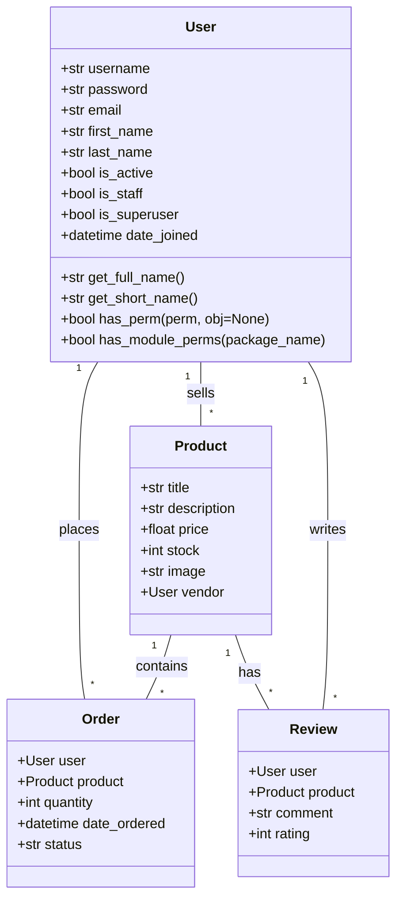
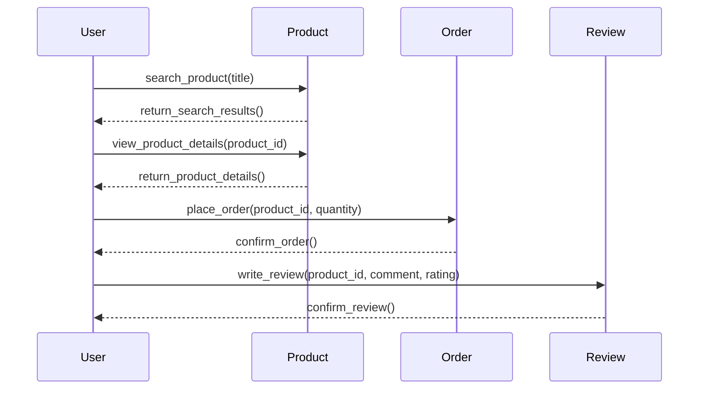

## Implementation approach
To implement the shopping platform, we will use the Django framework due to its scalability and robustness. Django's ORM will help us handle database operations efficiently. We will use PostgreSQL as our database due to its performance and scalability. For search functionality, we will use Elasticsearch, which provides powerful full-text search capabilities. For payment information, we will use Stripe API for secure payment processing. For user authentication and security, we will use Django's built-in authentication system. We will also use Docker for containerization which will help us ensure that the application runs the same way in every environment.

## Python package name
```python
"shopping_platform"
```

## File list
```python
[
    "main.py",
    "models.py",
    "views.py",
    "urls.py",
    "forms.py",
    "tests.py",
    "dockerfile",
    "requirements.txt",
]
```

## Data structures and interface definitions


## Program call flow


## Anything UNCLEAR
The requirement is clear to me.