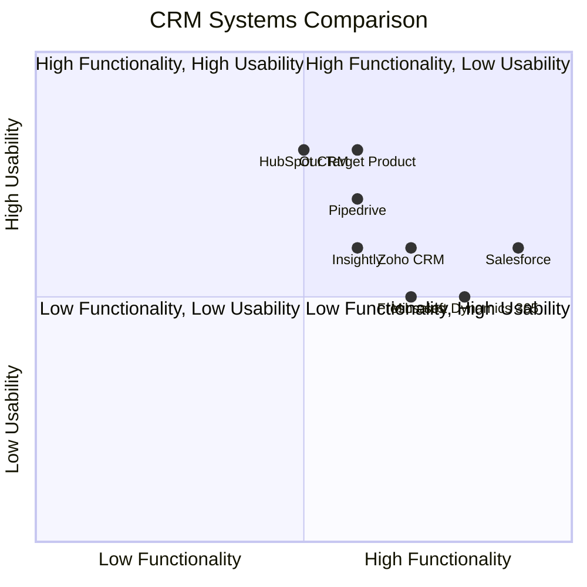

## Original Requirements
The boss has asked for a simple CRM system design with some basic functionality.

## Product Goals
```python
[
    "Create a user-friendly CRM system",
    "Ensure efficient data management and retrieval",
    "Provide basic CRM functionalities like contact management, interaction tracking, and reporting"
]
```

## User Stories
```python
[
    "As a sales representative, I want to easily add and manage customer contacts so that I can keep track of my interactions with them",
    "As a manager, I want to generate reports on sales activities so that I can make informed decisions",
    "As a user, I want to search and filter contacts based on various criteria so that I can find the information I need quickly",
    "As a user, I want to track my interactions with customers so that I can provide personalized service",
    "As a user, I want to have a dashboard where I can see an overview of my activities and performance"
]
```

## Competitive Analysis
```python
[
    "Salesforce: A comprehensive CRM solution with a wide range of features, but it may be too complex and expensive for small businesses",
    "Zoho CRM: Offers a good balance between functionality and cost, but the user interface could be improved",
    "HubSpot CRM: Free and user-friendly, but lacks advanced features",
    "Pipedrive: Designed for sales teams, easy to use, but lacks customization options",
    "Freshsales: Offers AI-based insights, but the mobile app needs improvement",
    "Insightly: Good for project management, but the reporting feature is limited",
    "Microsoft Dynamics 365: Integrated with other Microsoft products, but can be complex to set up"
]
```

## Competitive Quadrant Chart


## Requirement Analysis
The product should be a simple CRM system that provides basic functionalities such as contact management, interaction tracking, and reporting. It should be user-friendly and efficient in data management and retrieval.

## Requirement Pool
```python
[
    ("Contact management feature to add, edit, and delete contacts", "P0"),
    ("Interaction tracking feature to record and view interactions with customers", "P0"),
    ("Search and filter feature to find contacts based on various criteria", "P0"),
    ("Reporting feature to generate reports on sales activities", "P1"),
    ("Dashboard feature to view an overview of activities and performance", "P1")
]
```

## UI Design draft
The CRM system should have a clean and intuitive interface. The main page should be a dashboard showing an overview of the user's activities and performance. There should be a navigation bar on the left side with options to go to the contacts page, interactions page, and reports page. The contacts page should have a list of contacts with a search bar and filter options at the top. The interactions page should show a timeline of interactions with each contact. The reports page should have options to generate different types of reports.

## Anything UNCLEAR
There are no unclear points.