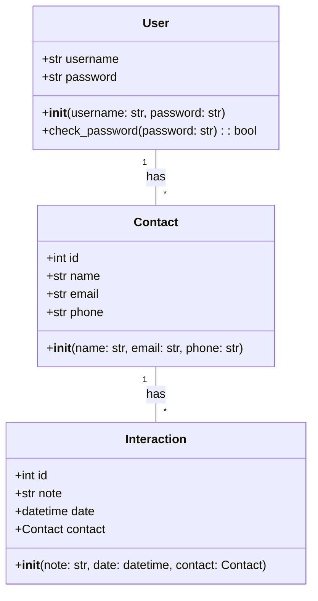
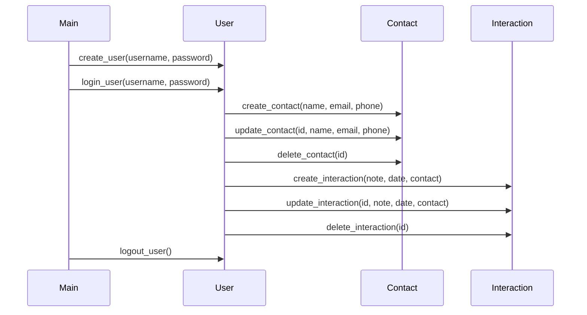

## Implementation approach
We will use Flask, a lightweight web framework, to build the CRM system. Flask-SQLAlchemy will be used for database operations, and Flask-WTForms for form handling. For the front-end, we will use Bootstrap to create a responsive and user-friendly interface. We will also use Flask-Login for user authentication. The system will be designed with a modular approach, separating the functionalities into different modules. The difficult points would be ensuring efficient data management and retrieval, and providing a user-friendly interface. 

## Python package name
```python
"simple_crm"
```

## File list
```python
[
    "main.py",
    "config.py",
    "models.py",
    "forms.py",
    "views.py",
    "templates/dashboard.html",
    "templates/contacts.html",
    "templates/interactions.html",
    "templates/reports.html",
    "static/css/main.css",
    "static/js/main.js"
]
```

## Data structures and interface definitions


## Program call flow


## Anything UNCLEAR
The requirement is clear to me.