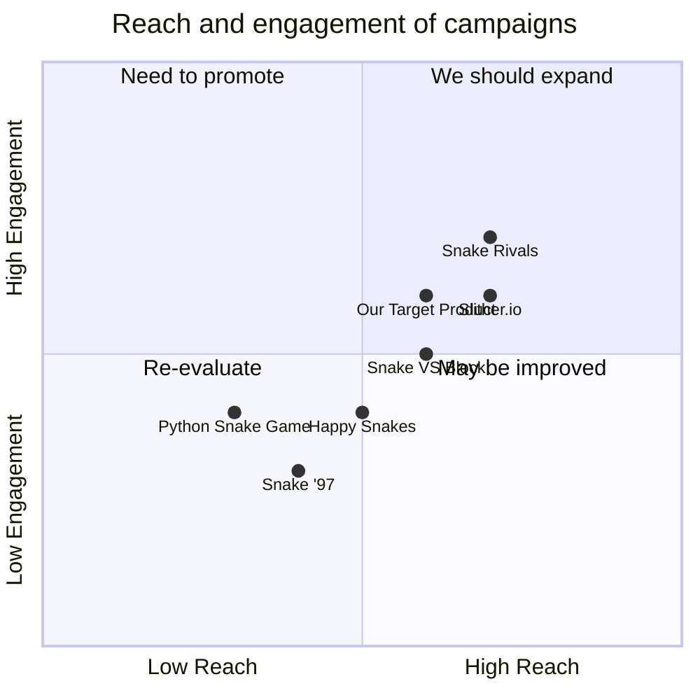

## Original Requirements
The boss has instructed to design the software of a fun snake game in Python. The task must be carried out in the role of an engineer, implying that the code should be written out.

## Product Goals
```python
[
    "Create an entertaining and engaging snake game",
    "Ensure the game is easy to understand and play",
    "Design the game to be visually appealing"
]
```

## User Stories
```python
[
    "As a user, I want to be able to easily understand the game rules so that I can start playing without confusion",
    "As a user, I want the game to be challenging so that I can improve my skills over time",
    "As a user, I want the game to have a visually appealing interface so that my game experience is enjoyable",
    "As a user, I want the game to run smoothly without any lags or glitches",
    "As a user, I want to be able to pause and resume the game at my convenience"
]
```

## Competitive Analysis
```python
[
    "Python Snake Game: Classic game with simple graphics, but lacks advanced features",
    "Slither.io: Online multiplayer game with advanced features, but may be too complex for some users",
    "Snake '97: Retro game that emulates the old mobile phone game, but lacks modern graphics",
    "Snake VS Block: Innovative twist on the classic game, but may be too difficult for some users",
    "Happy Snakes: Colorful graphics and easy gameplay, but lacks depth and challenge",
    "Snake Rivals: Multiplayer game with modern graphics, but requires internet connection to play"
]
```

## Competitive Quadrant Chart


## Requirement Analysis
The product should be a snake game designed in Python. It should be fun, engaging, easy to understand, and visually appealing. The game should run smoothly and allow users to pause and resume at their convenience.

## Requirement Pool
```python
[
    ("Design a simple and intuitive user interface", "P0"),
    ("Implement the basic functionality of the snake game", "P0"),
    ("Add feature to pause and resume the game", "P1"),
    ("Ensure the game runs smoothly without lags or glitches", "P0"),
    ("Create visually appealing graphics for the game", "P1")
]
```

## UI Design draft
The game should have a simple and clean interface. The game area should be clearly defined in the center of the screen. The score and game controls should be displayed at the top and bottom of the screen respectively. The game should have a modern and colorful design to make it visually appealing.

## Anything UNCLEAR
There are no unclear points.