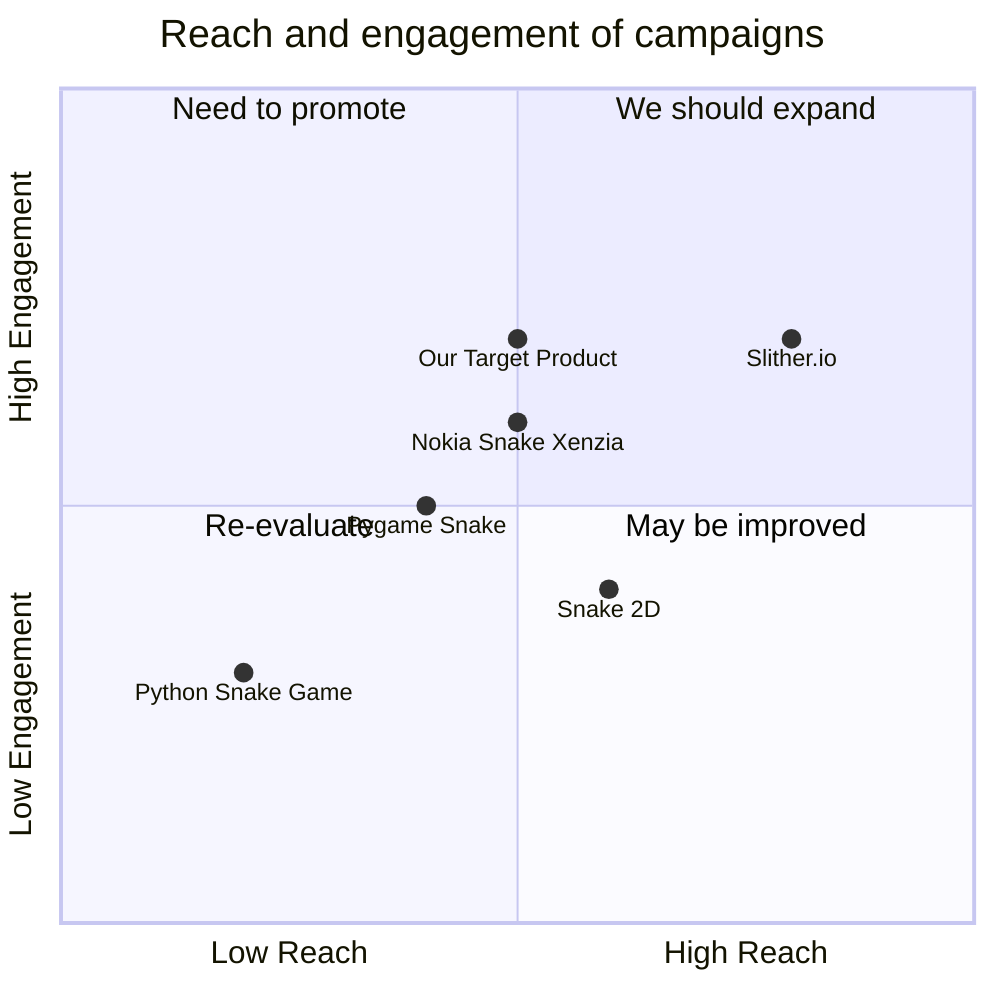

## Original Requirements
The boss has tasked us with designing a software for a fun snake game in Python.

## Product Goals
```python
[
    "Create a fun and engaging snake game using Python",
    "Ensure the game is easy to understand and play",
    "Design a visually appealing and intuitive user interface"
]
```

## User Stories
```python
[
    "As a user, I want to be able to easily start a new game so that I can play whenever I want",
    "As a user, I want the game to have clear rules so that I can understand how to play",
    "As a user, I want to be able to pause and resume the game so that I can take breaks",
    "As a user, I want the game to keep track of my high scores so that I can challenge myself to beat them",
    "As a user, I want the game to have a visually appealing interface so that my gaming experience is enjoyable"
]
```

## Competitive Analysis
```python
[
    "Python Snake Game: A simple, text-based snake game. Our product can stand out by offering a more visually appealing interface and additional features like pausing and resuming the game",
    "Pygame Snake: This game has a more advanced interface, but the controls can be confusing. Our product should focus on simplicity and ease of use",
    "Snake 2D: This game offers a 2D experience, but lacks features like pausing the game. Our product can fill this gap",
    "Slither.io: A multiplayer snake game. Our product can differentiate itself by focusing on a single-player experience",
    "Nokia Snake Xenzia: A classic snake game with a simple interface. Our product can offer a modern take on this classic game"
]
```

## Competitive Quadrant Chart


## Requirement Analysis
The product should be a snake game developed in Python. It should be fun, engaging, and easy to play. The game should have a visually appealing interface and features like starting a new game, pausing and resuming the game, and keeping track of high scores.

## Requirement Pool
```python
[
    ("Implement game logic for snake movement and food consumption", "P0"),
    ("Design a visually appealing and intuitive user interface", "P0"),
    ("Add functionality to start a new game", "P0"),
    ("Add functionality to pause and resume the game", "P1"),
    ("Implement a system to keep track of high scores", "P1")
]
```

## UI Design draft
The game will have a simple, clean, and colorful interface. The main screen will have options to start a new game, view high scores, and exit the game. The game screen will display the snake, food, and the current score. The game will be controlled using the arrow keys.

## Anything UNCLEAR
There are no unclear points.