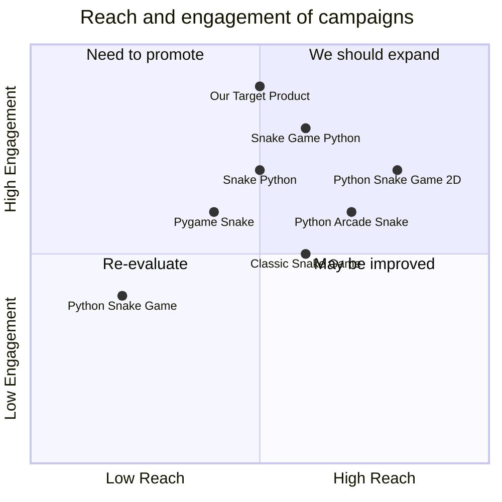

## Original Requirements
The boss has tasked us with designing a software product for a fun snake game in Python. The game should be coded by an engineer.

## Product Goals
```python
[
    "Create a fun and engaging snake game in Python",
    "Ensure the game is easy to understand and play",
    "Design the game to be visually appealing"
]
```

## User Stories
```python
[
    "As a user, I want to be able to easily start a new game, so I can play whenever I want",
    "As a user, I want the game to have a simple and intuitive interface, so I can play without confusion",
    "As a user, I want the game to have increasing difficulty, so it remains challenging and fun",
    "As a user, I want to be able to pause and resume the game, so I can take breaks",
    "As a user, I want to see my high score, so I can track my progress and aim to beat it"
]
```

## Competitive Analysis
```python
[
    "Python Snake Game: Simple and straightforward, but lacks visual appeal",
    "Pygame Snake: Offers different difficulty levels, but interface is not very intuitive",
    "Classic Snake Game: Very engaging with increasing speed, but lacks a pause feature",
    "Snake Python: Has a visually appealing interface, but game play is not very smooth",
    "Python Arcade Snake: Offers smooth game play, but lacks a high score feature",
    "Snake Game Python: Features a high score, but game does not have increasing difficulty",
    "Python Snake Game 2D: Has a 2D interface, but lacks variety in game play"
]
```

## Competitive Quadrant Chart


## Requirement Analysis
The product should be a snake game coded in Python. It should be fun, engaging, and visually appealing. The game should be easy to understand and play, with a simple and intuitive interface. It should offer increasing difficulty to keep the game challenging and fun. The game should also have a pause and resume feature, as well as a high score feature to track progress.

## Requirement Pool
```python
[
    ("Implement a simple and intuitive interface", "P0"),
    ("Design the game to have increasing difficulty", "P0"),
    ("Include a pause and resume feature", "P1"),
    ("Include a high score feature", "P1"),
    ("Ensure the game is visually appealing", "P2")
]
```

## UI Design draft
The game will have a simple and clean interface, with a game board occupying the majority of the screen. The snake will be a bright color to stand out against the background. The score and high score will be displayed at the top of the screen. There will be a start/pause button located at the bottom of the screen.

## Anything UNCLEAR
There are no unclear points.