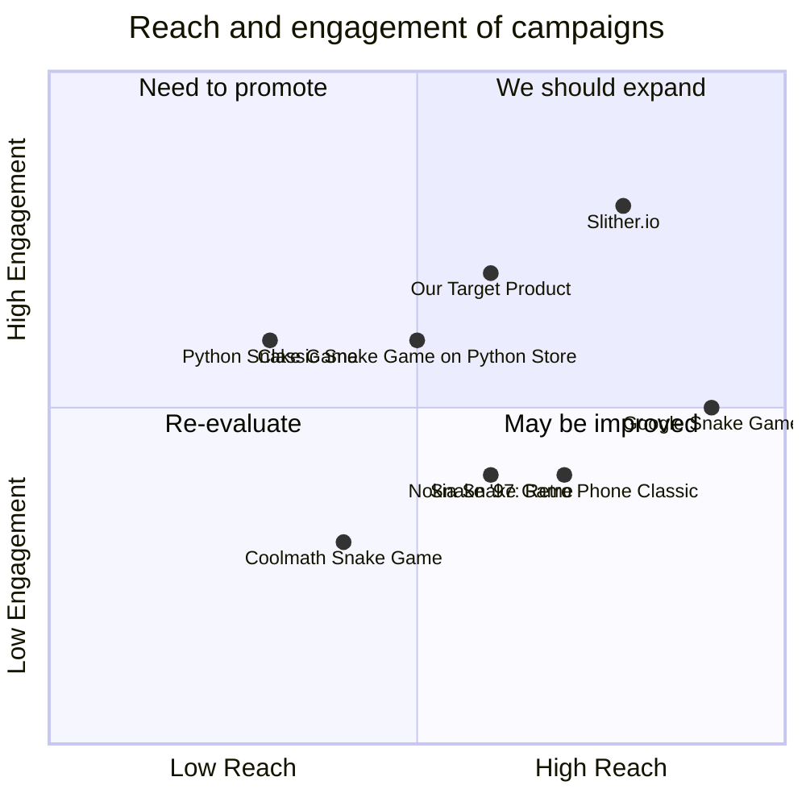

## Original Requirements
The boss has asked to design the software of a fun snake game in Python. The code for the game should be written by an engineer.

## Product Goals
```python
[
    "Create a fun, engaging and easy to play snake game in Python",
    "Ensure the game is lightweight and runs smoothly",
    "Incorporate user-friendly design and intuitive controls"
]
```

## User Stories
```python
[
    "As a user, I want to be able to easily control the snake so that I can play the game without difficulty",
    "As a user, I want the game to run smoothly so that I can have a seamless gaming experience",
    "As a user, I want the game to be challenging so that I can improve my skills and enjoy playing",
    "As a user, I want to be able to pause and resume the game so that I can play at my own pace",
    "As a user, I want to see my high score so that I can track my progress"
]
```

## Competitive Analysis
```python
[
    "Python Snake Game: Simple and easy to play but lacks advanced features",
    "Slither.io: Multiplayer game with advanced features but not developed in Python",
    "Nokia Snake Game: Classic game with nostalgic value but outdated graphics",
    "Google Snake Game: Accessible and user-friendly but lacks challenge",
    "Coolmath Snake Game: Educational but not as engaging",
    "Classic Snake Game on Python Store: Good user reviews but limited platform availability",
    "Snake '97: Retro Phone Classic: Offers classic feel but lacks modern updates"
]
```

## Competitive Quadrant Chart


## Requirement Analysis
The product should be a fun and engaging snake game developed in Python. It should have user-friendly controls and run smoothly. The game should also be challenging and allow users to track their high scores.

## Requirement Pool
```python
[
    ("Develop the basic game mechanics including snake movement and growth", "P0"),
    ("Implement a scoring system to track user's high scores", "P0"),
    ("Design an intuitive user interface for the game", "P0"),
    ("Incorporate a pause/resume feature for the game", "P1"),
    ("Ensure the game runs smoothly without any lags", "P0")
]
```

## UI Design draft
The game will have a simple and clean interface. The main screen will display the game area where the snake moves. The snake will be controlled using the arrow keys. The current score will be displayed at the top of the screen. There will be a pause button at the bottom of the screen. The game will have a retro design aesthetic with bright colors to make it visually appealing.

## Anything UNCLEAR
There are no unclear points.