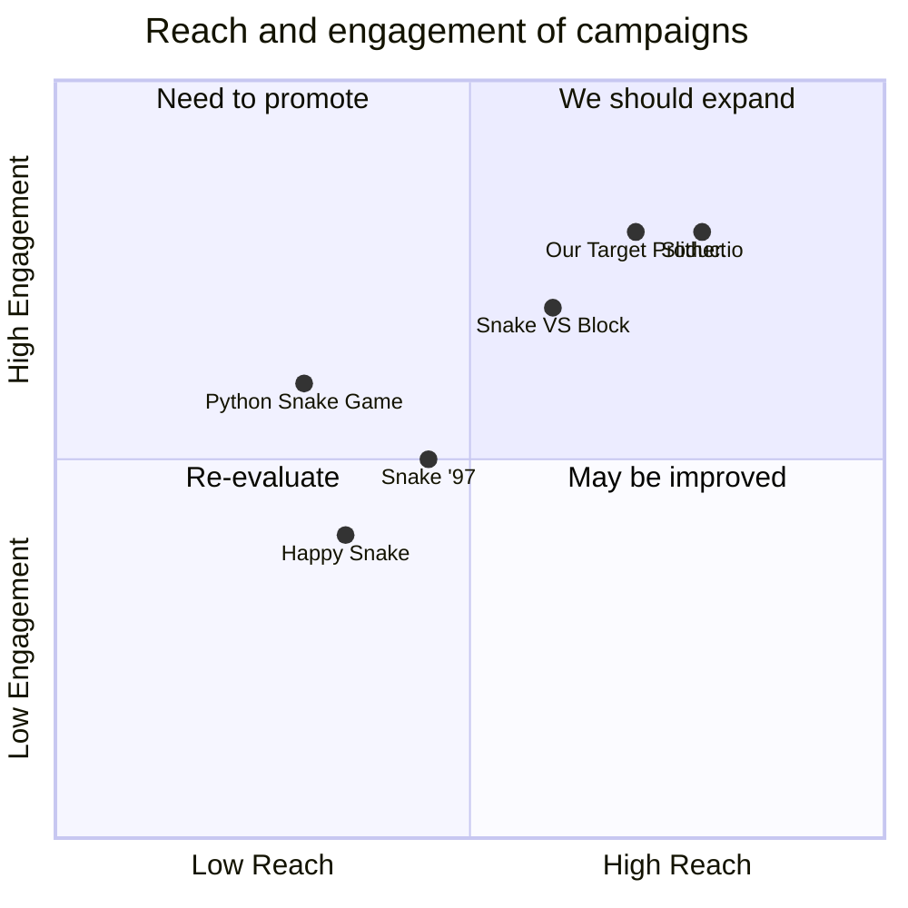

## Original Requirements
The boss has tasked us with designing the software for a fun snake game in Python. The code for the game should be written by an engineer.

## Product Goals
```python
[
    "Create a fun, engaging snake game",
    "Ensure the game is easy to understand and play",
    "Design the game to be visually appealing"
]
```

## User Stories
```python
[
    "As a user, I want to be able to easily understand the game rules so I can start playing quickly",
    "As a user, I want the game to be challenging so I can improve my skills",
    "As a user, I want to be able to see my high score so I can track my progress",
    "As a user, I want the game to be visually appealing so I can enjoy playing it",
    "As a user, I want the game to run smoothly without any glitches"
]
```

## Competitive Analysis
```python
[
    "Python Snake Game: Simple graphics, easy to understand, lacks variety in gameplay",
    "Slither.io: Multiplayer, more complex, visually appealing",
    "Snake '97: Classic design, nostalgic, simple gameplay",
    "Snake VS Block: Adds a new twist to the classic game, visually appealing",
    "Happy Snake: Simple design, easy to play, lacks challenging elements"
]
```

## Competitive Quadrant Chart


## Requirement Analysis
The product should be a fun and engaging snake game that is easy to understand and play. It should have visually appealing graphics and run smoothly without any glitches. The game should also include a feature to track high scores.

## Requirement Pool
```python
[
    ("Implement basic snake game mechanics", "P0"),
    ("Design visually appealing graphics", "P0"),
    ("Include a feature to track high scores", "P0"),
    ("Ensure the game runs smoothly without glitches", "P0"),
    ("Make the game challenging to improve user engagement", "P1")
]
```

## UI Design draft
The game should have a simple and clean interface. The main screen should display the game area, the current score, and the high score. The snake and the food should be easily distinguishable. The game should have a modern, flat design aesthetic with bright, contrasting colors.

## Anything UNCLEAR
There are no unclear points.