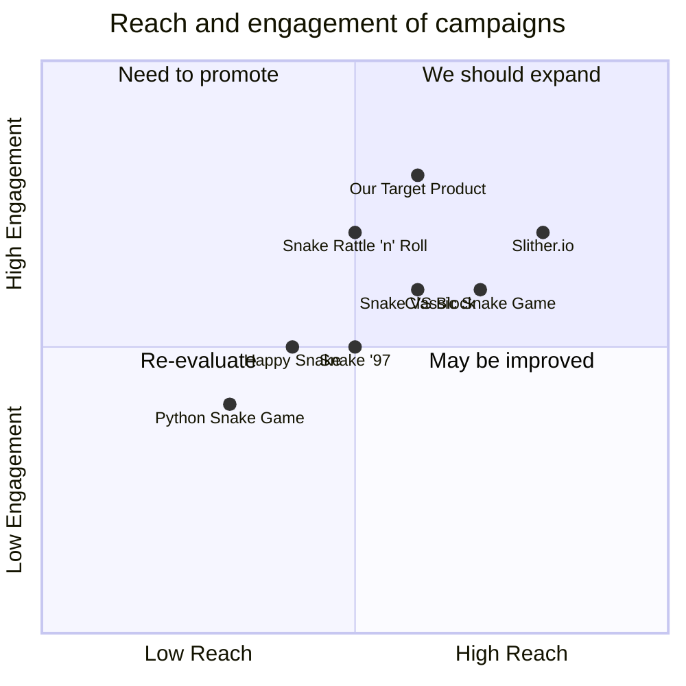

## Original Requirements
The boss has tasked me with designing the software for a fun snake game in Python. The code should be written by an engineer.

## Product Goals
```python
[
    "Create a fun and engaging snake game in Python",
    "Ensure the game is easy to understand and play",
    "Design the game to be visually appealing"
]
```

## User Stories
```python
[
    "As a user, I want to be able to easily start a new game so I can play whenever I want",
    "As a user, I want the game to be challenging so that I am engaged and entertained",
    "As a user, I want to be able to see my high score so I can track my progress",
    "As a user, I want the game to have a visually appealing design so I enjoy playing",
    "As a user, I want the game to run smoothly without any glitches or lags"
]
```

## Competitive Analysis
```python
[
    "Python Snake Game: Simple design, easy to play but lacks visual appeal",
    "Classic Snake Game: Very popular, offers different difficulty levels but graphics are outdated",
    "Slither.io: Multiplayer game, very engaging but can be complex for beginners",
    "Snake '97: Retro design, nostalgic but lacks modern features",
    "Snake VS Block: Innovative concept, challenging but can be frustrating for some players",
    "Happy Snake: Colorful design, fun to play but lacks depth",
    "Snake Rattle 'n' Roll: Unique 3D design, innovative but controls can be difficult"
]
```

## Competitive Quadrant Chart


## Requirement Analysis
The product should be a fun and engaging snake game designed in Python. It should be easy to understand and play, visually appealing, and run smoothly without any glitches or lags. The game should also allow users to see their high scores to track their progress.

## Requirement Pool
```python
[
    ("Design a simple and intuitive user interface", "P0"),
    ("Implement a scoring system to track high scores", "P0"),
    ("Ensure the game runs smoothly without any glitches or lags", "P0"),
    ("Create a visually appealing design for the game", "P1"),
    ("Add different difficulty levels for added challenge", "P2")
]
```

## UI Design draft
The game should have a simple and clean user interface. The main screen should display the game area, the current score, and the high score. The game area should be a grid where the snake moves. The snake and the food item should be distinct and easy to identify. The design should be colorful and visually appealing to engage users.

## Anything UNCLEAR
There are no unclear points.