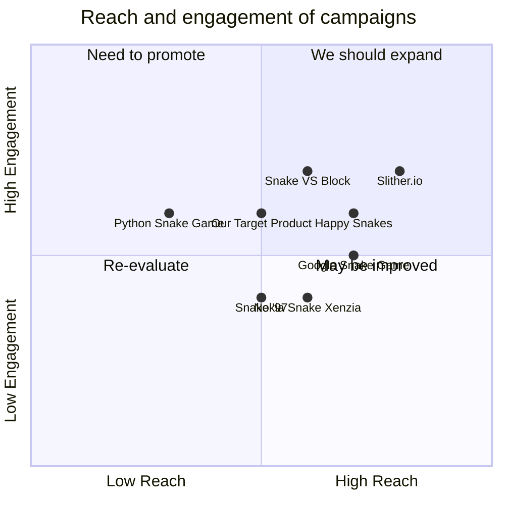

## Original Requirements
The boss has tasked us with designing the software for a fun snake game in Python. The game should be coded by an engineer.

## Product Goals
```python
[
    "Create an engaging and fun snake game",
    "Ensure the game is easy to understand and play",
    "Design the game with a clean and appealing user interface"
]
```

## User Stories
```python
[
    "As a user, I want to easily start a new game so that I can play whenever I want",
    "As a user, I want the game to have smooth controls so that I can effectively control the snake",
    "As a user, I want to see my score while playing so that I can track my progress",
    "As a user, I want the game to become progressively harder so that I am constantly challenged",
    "As a user, I want the game to have a clean and appealing interface so that my gaming experience is enjoyable"
]
```

## Competitive Analysis
```python
[
    "Python Snake Game: Simple, easy to play, lacks a visually appealing interface",
    "Slither.io: Multiplayer, visually appealing, but not coded in Python",
    "Nokia Snake Xenzia: Classic, nostalgic, but lacks modern design elements",
    "Google Snake Game: Accessible, simple design, but lacks depth in gameplay",
    "Snake '97: Classic retro design, but lacks modern gameplay elements",
    "Happy Snakes: Colorful design, multiplayer, but not coded in Python",
    "Snake VS Block: Innovative gameplay, but lacks the classic snake game feel"
]
```

## Competitive Quadrant Chart


## Requirement Analysis
The product should be a fun and engaging snake game coded in Python. It should have a clean and appealing user interface, easy controls, and a scoring system. The game should also become progressively harder to keep the user engaged.

## Requirement Pool
```python
[
    ("Design the game with a clean and appealing user interface", "P0"),
    ("Implement smooth controls for the snake", "P0"),
    ("Include a scoring system to track progress", "P0"),
    ("Ensure the game becomes progressively harder", "P1"),
    ("Allow the user to easily start a new game", "P0")
]
```

## UI Design draft
The game will have a simple and clean design with a focus on usability. The main screen will display the game area, the current score, and a 'New Game' button. The snake will be controlled using the arrow keys. The game area will be a grid where the snake moves, and the score will be displayed at the top of the screen.

## Anything UNCLEAR
There are no unclear points.