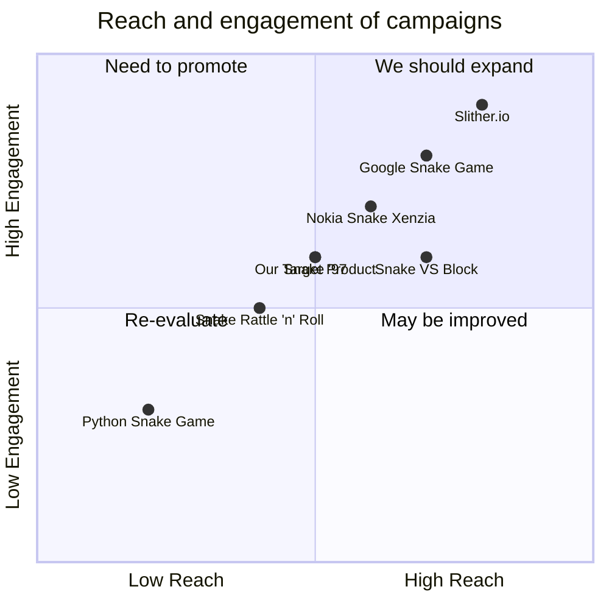

## Original Requirements
The boss has requested a fun snake game to be developed in Python.

## Product Goals
```python
[
    "Create a simple yet engaging snake game using Python",
    "Ensure the game is user-friendly and intuitive",
    "Incorporate a scoring system to increase competitiveness"
]
```

## User Stories
```python
[
    "As a user, I want to be able to easily navigate the snake so that I can play the game without confusion",
    "As a user, I want to see my score while playing so that I can track my progress",
    "As a user, I want the game to increase in difficulty as my score increases so that the game remains challenging",
    "As a user, I want to be able to restart the game quickly after losing so that I can try to beat my score",
    "As a user, I want the game to have a visually appealing interface so that my gaming experience is enjoyable"
]
```

## Competitive Analysis
```python
[
    "Python Snake Game: A simple snake game with no scoring system",
    "Slither.io: A multiplayer online game with a complex interface and scoring system",
    "Google Snake Game: A simple yet engaging game with a scoring system and increasing difficulty",
    "Nokia Snake Xenzia: A classic game with simple controls and a scoring system",
    "Snake '97: A retro game with a scoring system and increasing difficulty",
    "Snake VS Block: A game with a unique twist to the classic snake game, includes scoring system",
    "Snake Rattle 'n' Roll: A 3D snake game with complex controls and scoring system"
]
```

## Competitive Quadrant Chart


## Requirement Analysis
The product should be a simple, engaging, and user-friendly snake game developed in Python. It should include a scoring system and the difficulty should increase as the user's score increases. The game should also have a visually appealing interface.

## Requirement Pool
```python
[
    ("Develop the basic functionality of the snake game (snake movement, food spawning, collision detection)", "P0"),
    ("Implement a scoring system that increases as the snake eats food", "P0"),
    ("Increase the speed of the snake as the score increases to add difficulty", "P1"),
    ("Design a simple and visually appealing user interface", "P1"),
    ("Add a 'restart game' feature that allows users to quickly start a new game", "P2")
]
```

## UI Design draft
The game will have a simple 2D interface. The snake will be represented as a line that grows in length as it eats food. The food will be represented as small dots that appear randomly on the screen. The score will be displayed at the top of the screen. The game will have a 'start/restart' button and a 'quit' button.

## Anything UNCLEAR
There are no unclear points.