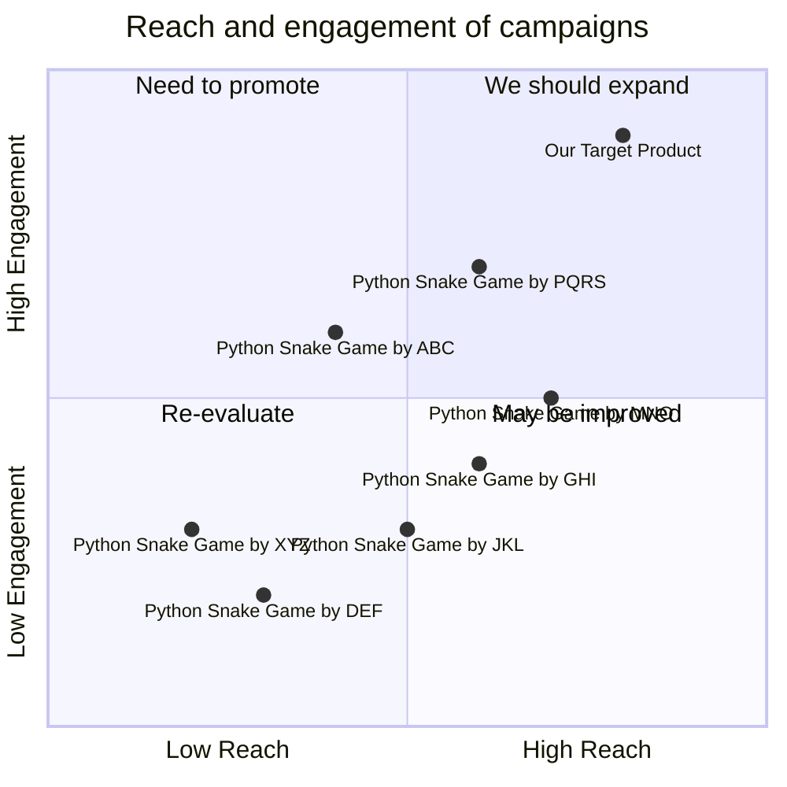

## Original Requirements
The boss has asked to design the software of a fun snake game in Python. The software should be written by an engineer role.

## Product Goals
```python
[
    "Create a fun and engaging snake game in Python",
    "Ensure the game is easy to understand and play",
    "Optimize the game for performance and efficiency"
]
```

## User Stories
```python
[
    "As a user, I want to easily start a new game so that I can play whenever I want",
    "As a user, I want the game to respond quickly to my commands so that I can effectively control the snake",
    "As a user, I want to be able to pause and resume the game so that I can take breaks",
    "As a user, I want to see my high score so that I can track my progress and aim to beat it",
    "As a user, I want the game to have a simple and clean interface so that I can focus on the gameplay"
]
```

## Competitive Analysis
```python
[
    "Python Snake Game by XYZ: Offers a basic snake game with limited features",
    "Python Snake Game by ABC: Includes additional features like power-ups and multiple difficulty levels",
    "Python Snake Game by DEF: Has a simple interface but lacks responsiveness",
    "Python Snake Game by GHI: Offers a multiplayer mode but has performance issues",
    "Python Snake Game by JKL: Has a complex interface that can be confusing for new players",
    "Python Snake Game by MNO: Offers a variety of snake skins but lacks in gameplay mechanics",
    "Python Snake Game by PQRS: Has a good balance of features and performance but lacks in visual appeal"
]
```

## Competitive Quadrant Chart


## Requirement Analysis
The product should be a snake game developed in Python. It should be fun, engaging, and easy to understand and play. The game should respond quickly to user commands and allow users to pause and resume the game. It should also display the user's high score and have a simple and clean interface.

## Requirement Pool
```python
[
    ("Develop the basic game mechanics of the snake game", "P0"),
    ("Implement a user-friendly interface for the game", "P0"),
    ("Add a feature to display the user's high score", "P1"),
    ("Add a feature to pause and resume the game", "P1"),
    ("Optimize the game for performance and efficiency", "P2")
]
```

## UI Design draft
The game should have a simple and clean interface. The game area should be centrally located with the score and controls displayed around it. The game should have a start, pause, and resume button. The snake and the food item should be easily distinguishable.

## Anything UNCLEAR
There are no unclear points.