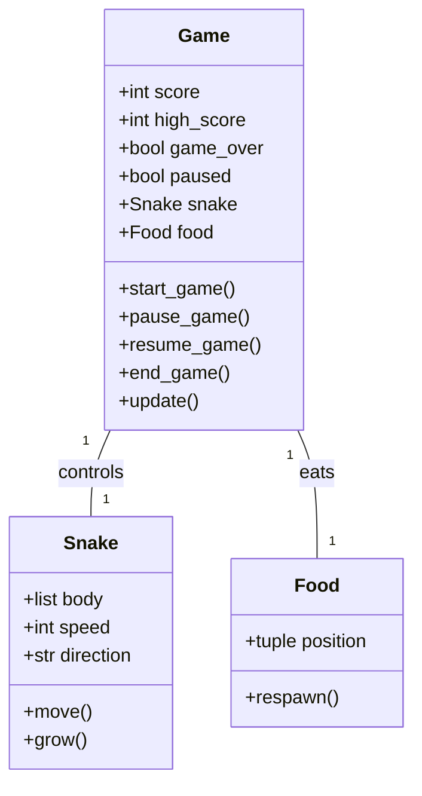
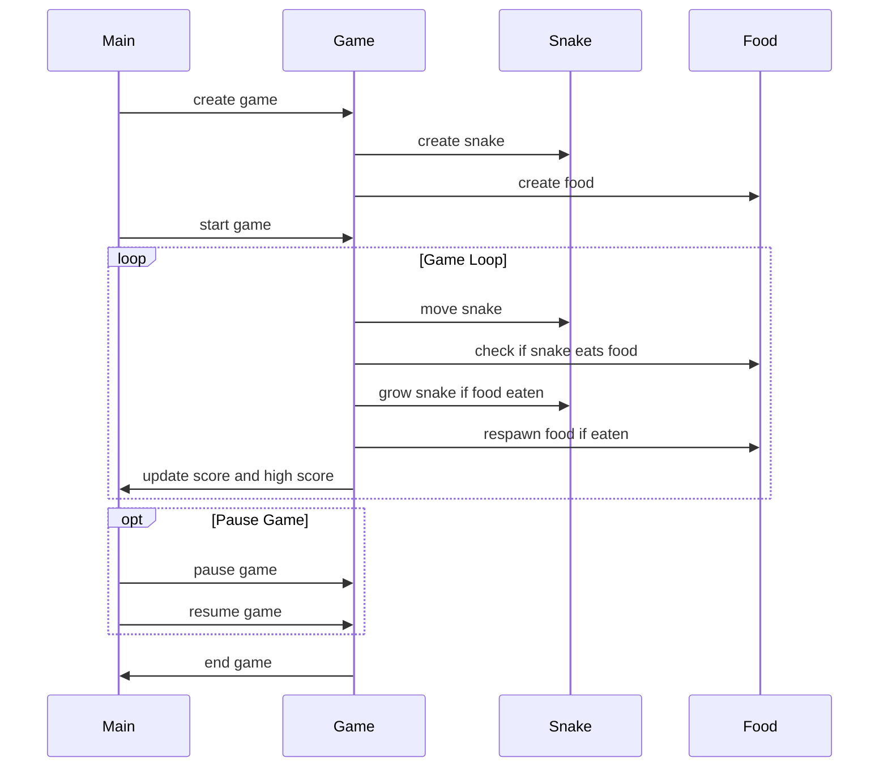

## Implementation approach
We will use Pygame, an open-source Python library designed for making video games, to create our snake game. Pygame provides us with the necessary tools to create a game window, draw objects, handle user input, and more. We will create a Game class to handle the game logic, a Snake class to represent the player-controlled snake, and a Food class to represent the food the snake eats. The game will increase in difficulty by speeding up the snake each time it eats food. We will also implement a simple GUI to display the current score and high score, and to allow the user to start, pause, and resume the game.

## Python package name
```python
"snake_game"
```

## File list
```python
[
    "main.py",
    "game.py",
    "snake.py",
    "food.py",
    "gui.py"
]
```

## Data structures and interface definitions


## Program call flow


## Anything UNCLEAR
The requirement is clear to me.