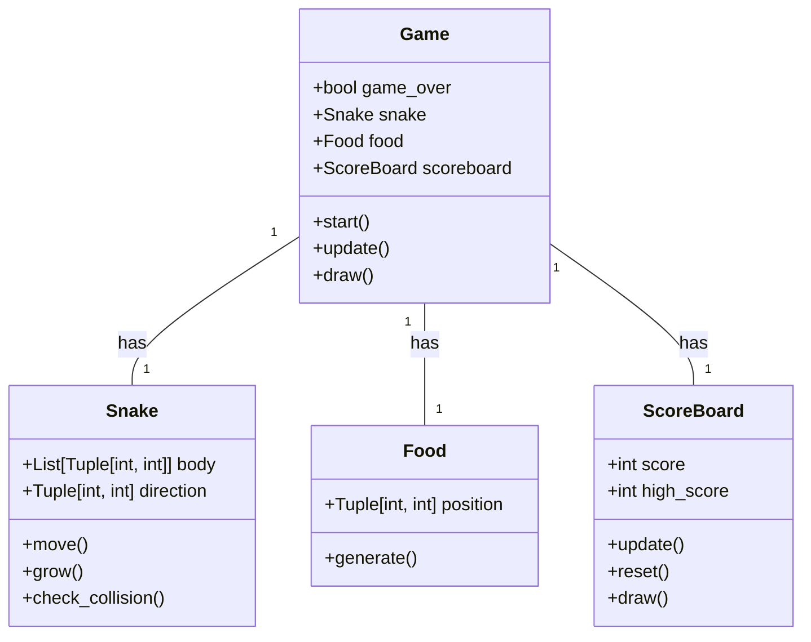
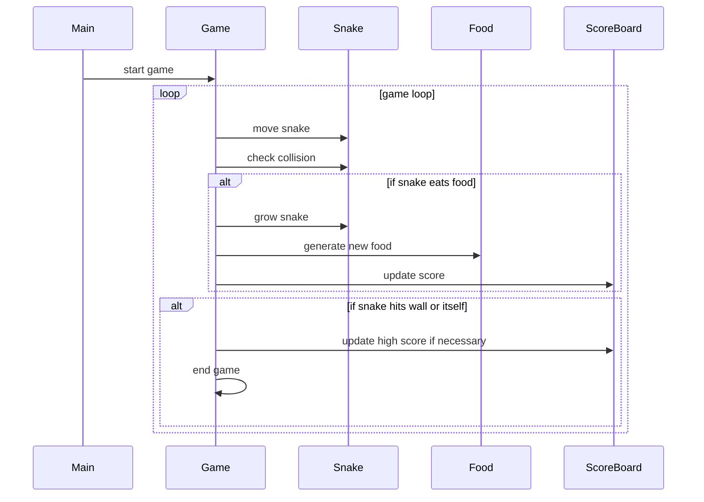

## Implementation approach
We will use the Pygame library, which is a set of Python modules designed for writing video games. Pygame adds functionality on top of the excellent SDL library. This allows you to create fully featured games and multimedia programs in Python. Pygame is highly portable and runs on almost every platform and operating system.
The game logic will be implemented in a Game class, which will handle the game loop, user input, and game state. The Snake and Food classes will be used to represent the snake and the food respectively. The ScoreBoard class will be used to track and display the current and high scores.

## Python package name
```python
"snake_game"
```

## File list
```python
[
    "main.py",
    "game.py",
    "snake.py",
    "food.py",
    "scoreboard.py"
]
```

## Data structures and interface definitions


## Program call flow


## Anything UNCLEAR
The requirement is clear to me.