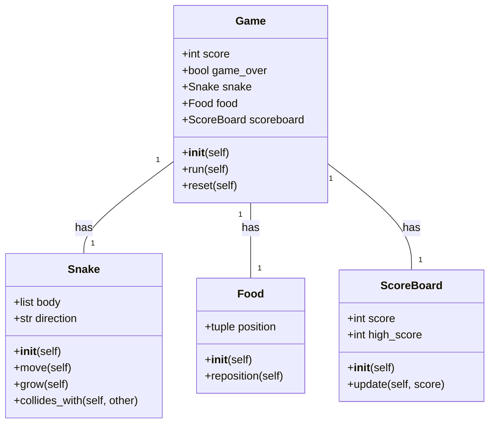
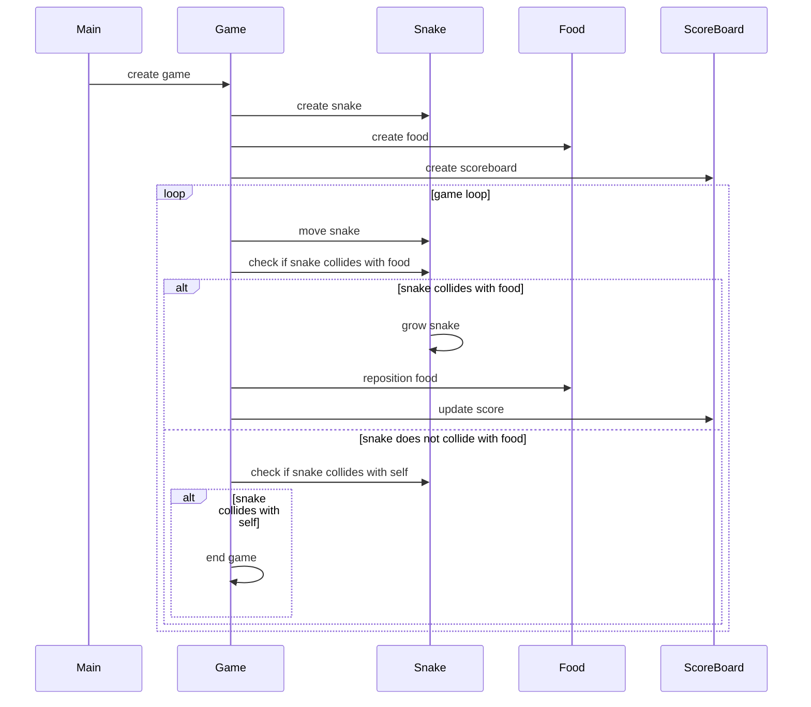

## Implementation approach
We will use Pygame, a set of Python modules designed for writing video games. Pygame adds functionality on top of the excellent SDL library. This allows you to create fully featured games and multimedia programs in the Python language. Pygame is highly portable and runs on almost every platform and operating system. 

The difficult points of the requirements are the game logic, the user interface, and the score tracking. Pygame provides tools to handle these aspects. The game logic will be implemented in a Game class, the user interface will be drawn using Pygame's drawing functions, and the score will be tracked in the Game class and displayed using Pygame's font module.

## Python package name
```python
"snake_game"
```

## File list
```python
[
    "main.py",
    "game.py",
    "snake.py",
    "food.py",
    "scoreboard.py"
]
```

## Data structures and interface definitions


## Program call flow


## Anything UNCLEAR
The requirement is clear to me.