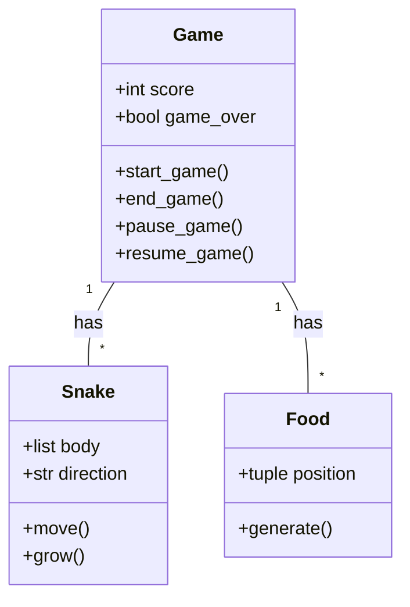
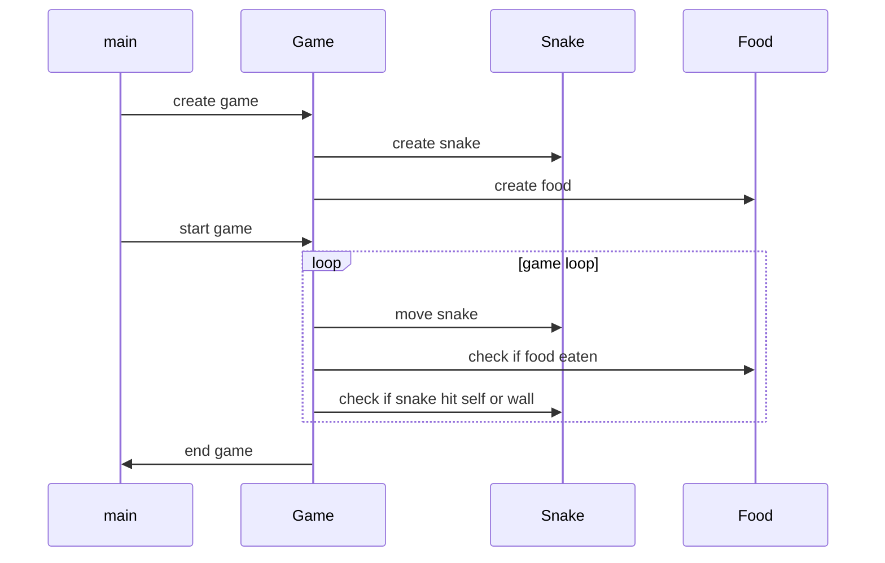

## Implementation approach
We will use the Pygame library, an open-source module for Python, to develop the game. Pygame provides functionalities for game development like handling events, rendering graphics, and playing sounds which will be useful for our project. 

The game will be divided into two main parts: the game logic and the user interface. The game logic will handle the movement of the snake, the generation of food items, and the scoring system. The user interface will handle the rendering of the game, the display of the score, and user inputs.

The game will be developed in an object-oriented manner with classes for the game, the snake, and the food items. This will make the code more modular, easier to understand, and easier to maintain.

## Python package name
```python
"snake_game"
```

## File list
```python
[
    "main.py",
    "game.py",
    "snake.py",
    "food.py",
    "constants.py"
]
```

## Data structures and interface definitions


## Program call flow


## Anything UNCLEAR
The requirement is clear to me.