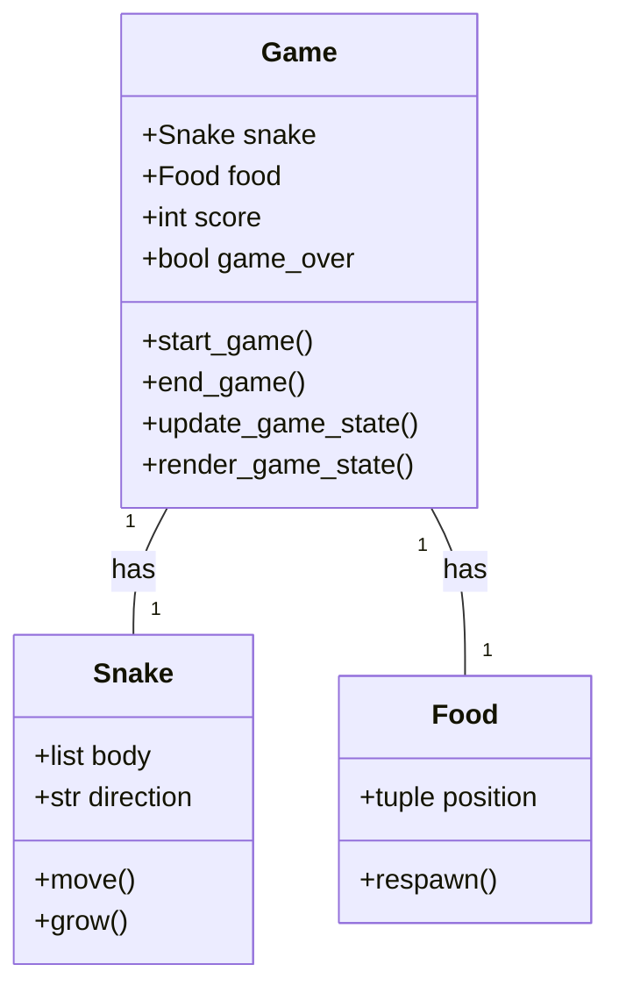
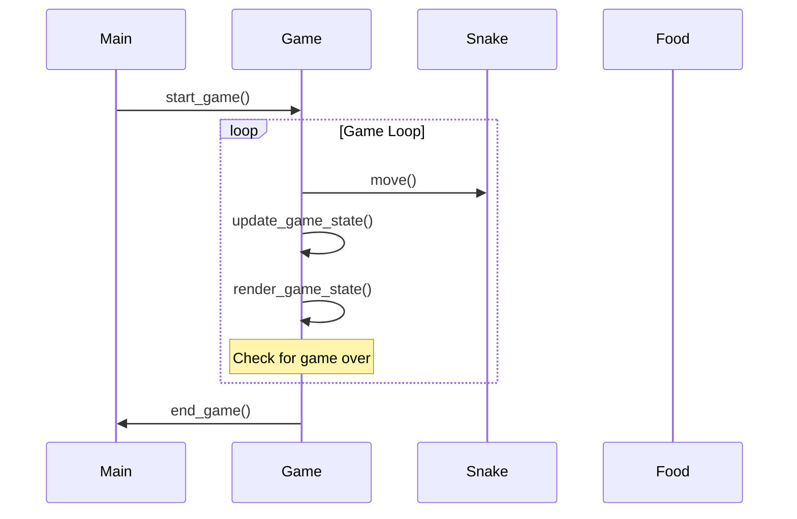

## Implementation approach
We will use the Pygame library, an open-source Python library designed for making video games. It includes computer graphics and sound libraries. Pygame is highly portable and runs on almost every platform and operating system. 

The game will be divided into three main parts: 
1. Game Initialization: This is where we will initialize the Pygame library, define game variables, and create the game window.
2. Game Loop: This is the main loop where all the action happens. It includes event handling (like checking for key presses), updating the game state (like moving the snake and checking for collisions), and rendering the game state to the screen.
3. Game Over: This is where we will handle the end of the game, display the final score, and provide an option to restart the game.

The game will be developed in an object-oriented manner, with separate classes for the Snake, Food, and Game.

## Python package name
```python
"snake_game"
```

## File list
```python
[
    "main.py",
    "snake.py",
    "food.py",
    "game.py"
]
```

## Data structures and interface definitions


## Program call flow


## Anything UNCLEAR
The requirement is clear to me.