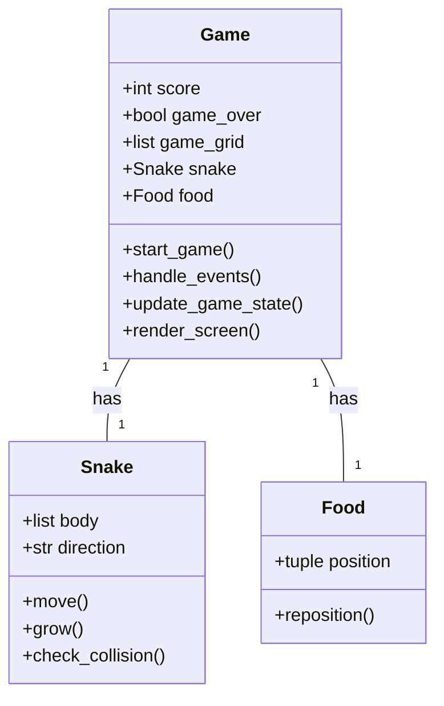
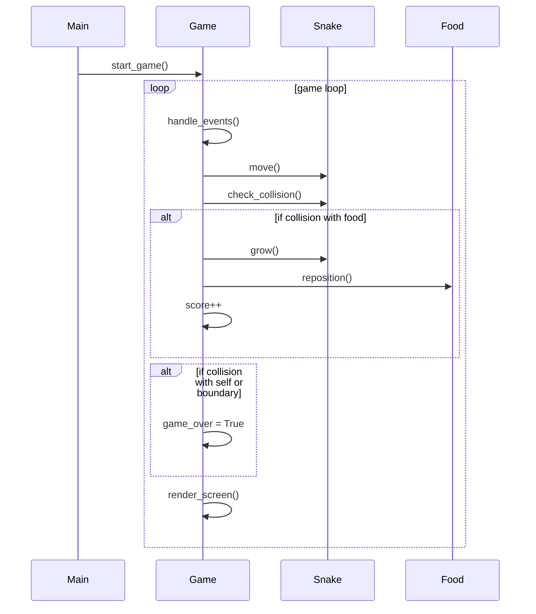

## Implementation approach
We will use the Pygame library, an open-source module for Python, to create the snake game. Pygame is great for both beginner and intermediate programmers, as it allows for the creation of fully featured games and multimedia programs in the python language. 

The game will have a main game loop which will handle events, update the game state, and render the result to the screen. The snake will be represented as a list of positions on the grid. The food will be a single position on the grid. We will use Pygame's built-in functions for drawing rectangles to the screen for both the snake and the food.

The game will end when the snake collides with the game boundaries or with itself. The score will be displayed on the screen and will increase each time the snake eats the food.

## Python package name
```python
"snake_game"
```

## File list
```python
[
    "main.py",
    "game.py",
    "snake.py",
    "food.py"
]
```

## Data structures and interface definitions


## Program call flow


## Anything UNCLEAR
The requirement is clear to me.