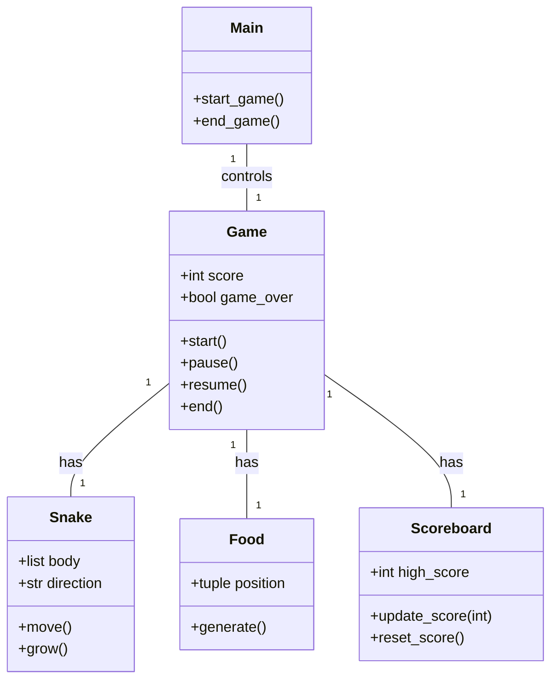
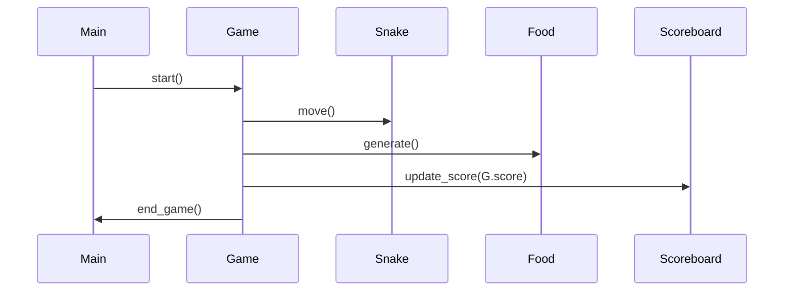

## Implementation approach
We will use the Pygame library, which is an open-source module for Python designed for game development. It includes computer graphics and sound libraries. The main challenges will be implementing the game logic, handling user input, and managing the game state. We will start by creating a basic version of the game, then add additional features like pausing the game and tracking high scores.

## Python package name
```python
"snake_game"
```

## File list
```python
[
    "main.py",
    "game.py",
    "snake.py",
    "food.py",
    "scoreboard.py"
]
```

## Data structures and interface definitions


## Program call flow


## Anything UNCLEAR
The requirement is clear to me.