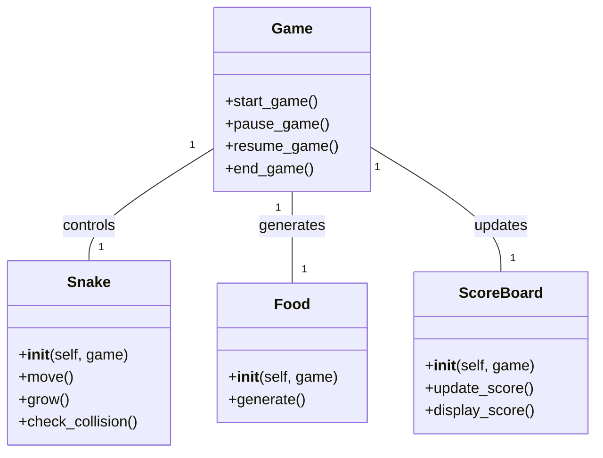
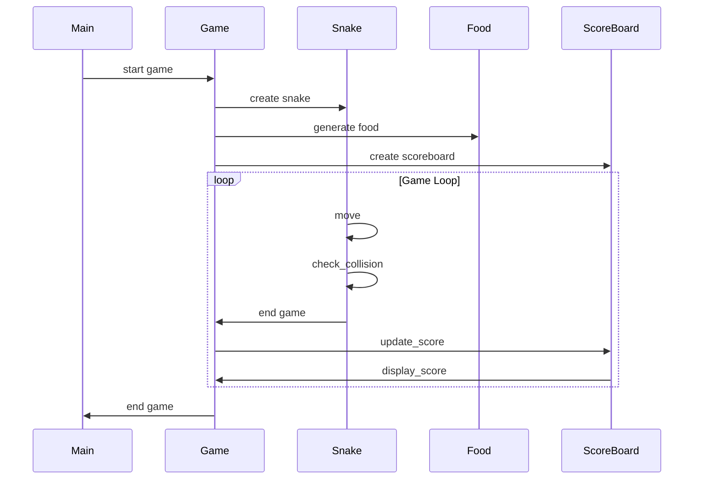

## Implementation approach
We will use the Pygame library, an open-source Python library designed for making video games. It includes computer graphics and sound libraries. Pygame is highly portable and runs on almost every platform and operating system. It will allow us to easily handle user inputs, draw graphics, and manage timing for the game. We will also use the Pygame GUI library for creating user interfaces. 

The main challenge will be implementing the game logic for the snake's movement and growth, collision detection, and scoring system. We will need to ensure that the game runs smoothly without any lags. 

## Python package name
```python
"snake_game"
```

## File list
```python
[
    "main.py",
    "game.py",
    "snake.py",
    "food.py",
    "scoreboard.py",
    "constants.py"
]
```

## Data structures and interface definitions


## Program call flow


## Anything UNCLEAR
The requirement is clear to me.