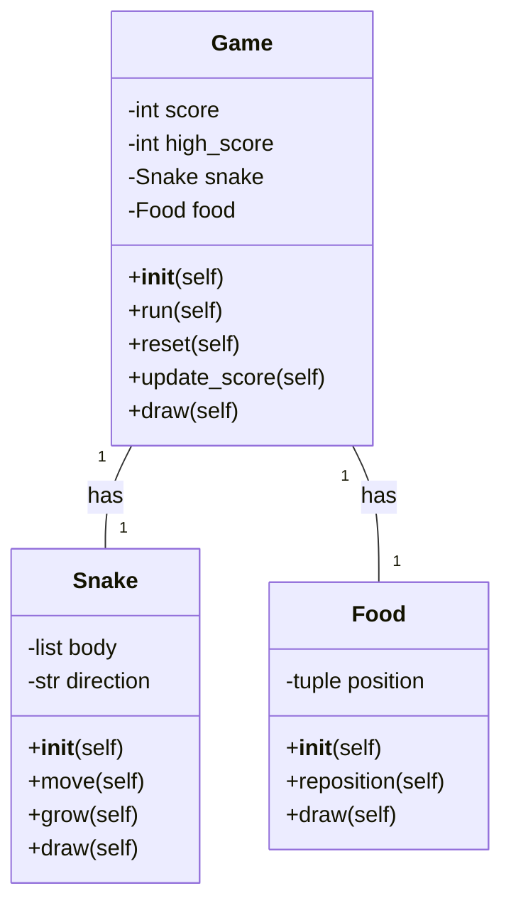
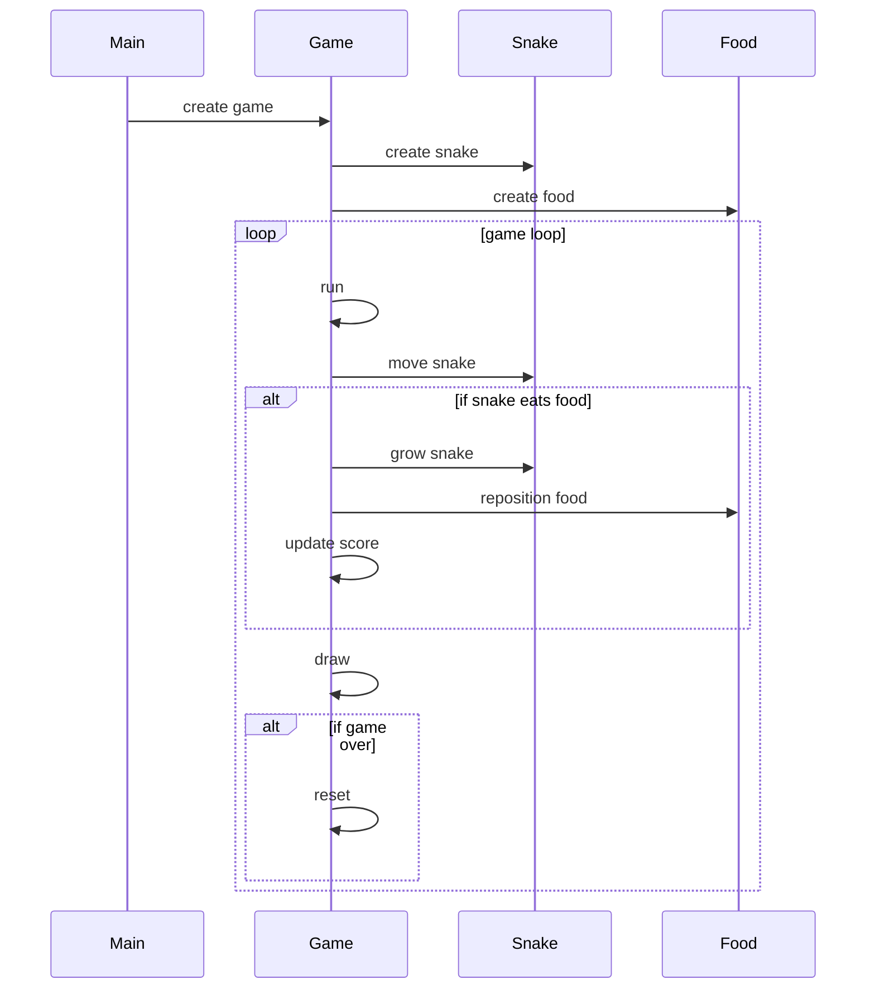

## Implementation approach
We will be using the Pygame library, an open-source module for Python, to create the snake game. Pygame is a set of Python modules designed for writing video games which provides functionalities such as drawing on the screen, handling keyboard and mouse events, playing sounds, and more. The game will have a Game class which will handle the game logic, a Snake class which will handle the snake's movement and growth, and a Food class to handle the placement of food in the game. The game's difficulty level can be adjusted by increasing the speed of the snake.

## Python package name
```python
"snake_game"
```

## File list
```python
[
    "main.py",
    "game.py",
    "snake.py",
    "food.py",
    "constants.py"
]
```

## Data structures and interface definitions


## Program call flow


## Anything UNCLEAR
The requirement is clear to me.