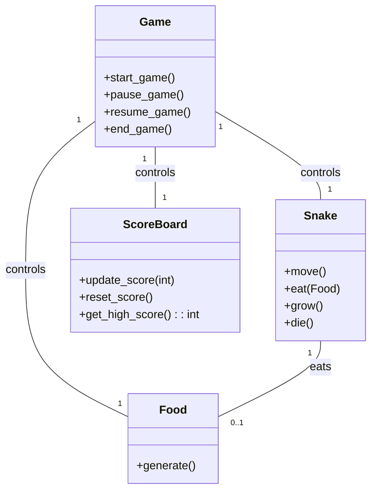
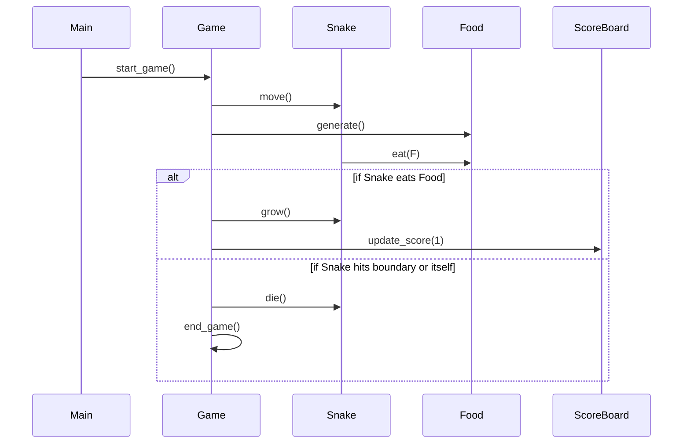

## Implementation approach
We will use the Pygame open-source library to create the snake game. Pygame is a set of Python modules designed for writing video games and provides the functionality needed for our game such as handling events, drawing graphics, and updating the game state. The difficult points of the requirements include designing the game logic for snake movement and food consumption, creating a visually appealing and intuitive user interface, and implementing a system to keep track of high scores. We will tackle these challenges by dividing the tasks into smaller, manageable parts and developing them iteratively.

## Python package name
```python
"snake_game"
```

## File list
```python
[
    "main.py",
    "game.py",
    "snake.py",
    "food.py",
    "scoreboard.py"
]
```

## Data structures and interface definitions


## Program call flow


## Anything UNCLEAR
The requirement is clear to me.