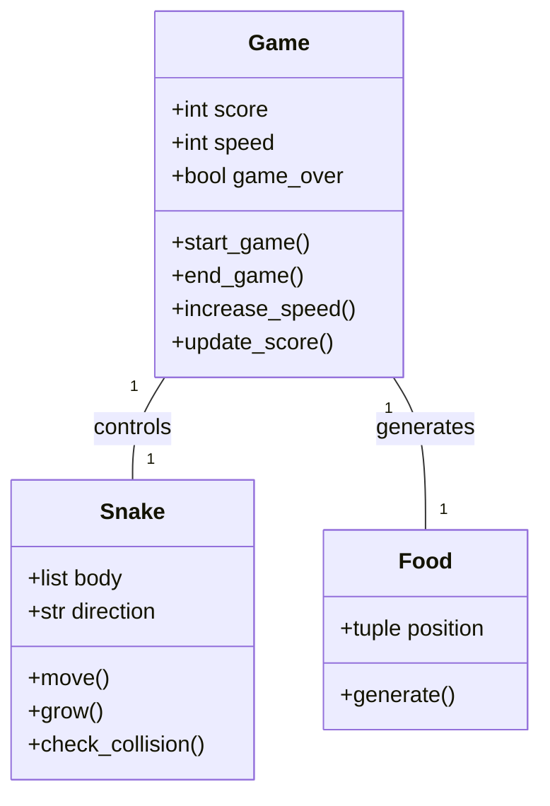
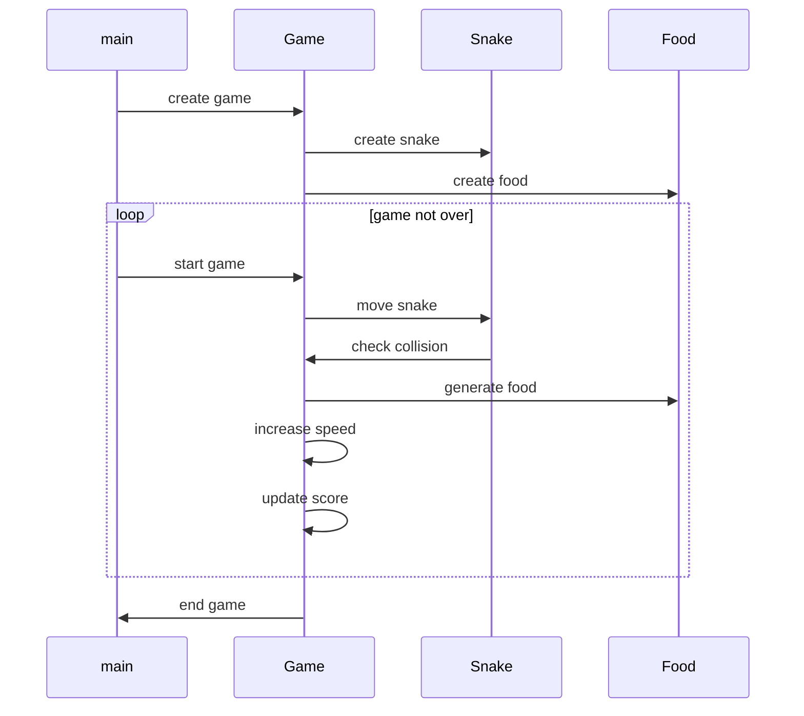

## Implementation approach
We will be using the Pygame library, an open-source module for Python designed for video game creation. It includes computer graphics and sound libraries. Pygame is highly portable and runs on almost every platform and operating system. We will also use the os and random libraries that come with Python. The os library will be used to center the game window on the user's screen, and the random library will be used to generate random positions for the food in the game.

The main challenges in the implementation would be handling the game logic like the movement of the snake, collision detection with the food and the boundaries, and increasing the speed of the snake as the game progresses. Pygame provides good support for handling these.

## Python package name
```python
"snake_game"
```

## File list
```python
[
    "main.py",
    "game.py",
    "snake.py",
    "food.py"
]
```

## Data structures and interface definitions


## Program call flow


## Anything UNCLEAR
The requirement is clear to me.