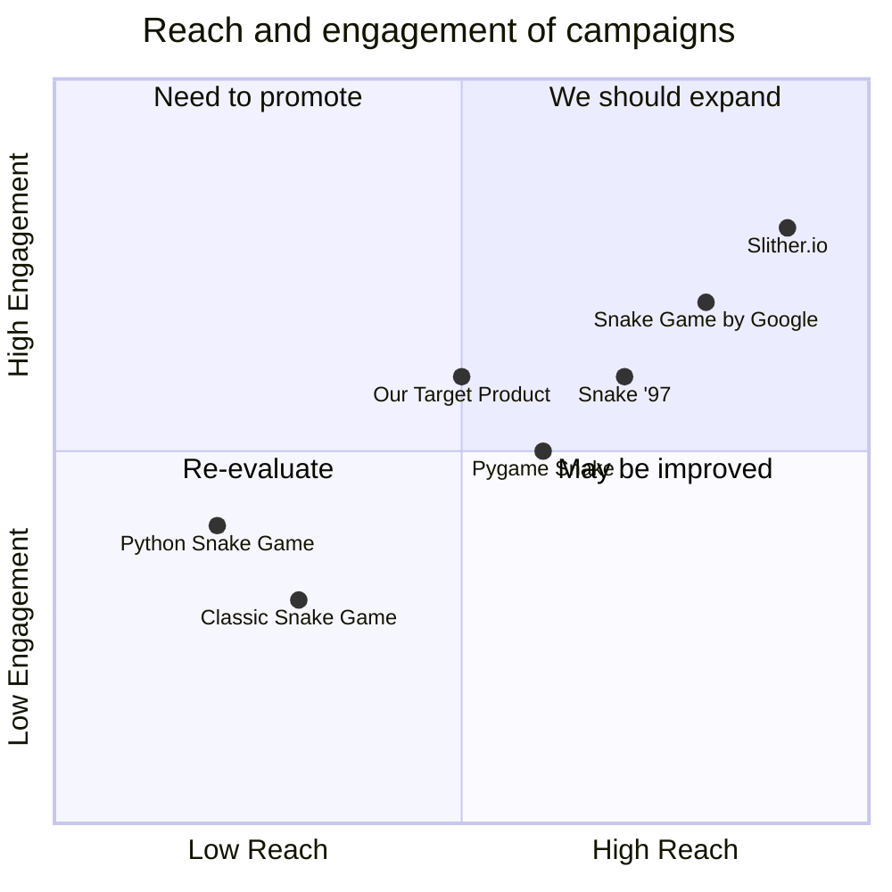

## Original Requirements
The boss has asked to create a fun snake game in Python.

## Product Goals
```python
[
    "Create a simple, fun and interactive snake game",
    "Ensure the game is easy to understand and play",
    "Ensure the game runs smoothly without any glitches"
]
```

## User Stories
```python
[
    "As a user, I want to be able to control the snake easily so that I can enjoy the game",
    "As a user, I want to see my score while playing so that I can track my progress",
    "As a user, I want the game to be challenging so that I can improve my skills",
    "As a user, I want the game to run smoothly without any interruptions or glitches"
]
```

## Competitive Analysis
```python
[
    "Python Snake Game: A simple snake game with basic functionalities",
    "Pygame Snake: A more advanced version with additional features",
    "Classic Snake Game: A classic version of the snake game with minimalistic design",
    "Snake Game by Google: A web-based snake game with high user engagement",
    "Slither.io: A multiplayer online snake game with high user interaction",
    "Snake '97: A retro phone classic game, very popular among users"
]
```

## Competitive Quadrant Chart


## Requirement Analysis
The product should be a fun and interactive snake game developed in Python. It should have a simple and intuitive user interface. The game should include basic functionalities like controlling the snake, eating the food, and keeping track of the score. The game should run smoothly without any glitches.

## Requirement Pool
```python
[
    ("Develop the basic structure of the game including the snake and the food", "P0"),
    ("Implement the functionality to control the snake", "P0"),
    ("Implement the functionality to keep track of the score", "P0"),
    ("Ensure the game runs smoothly without any glitches", "P0"),
    ("Add a feature to increase the speed of the snake as the score increases", "P1")
]
```

## UI Design draft
The game will have a simple and clean interface. The main element will be the game area where the snake moves around. The score will be displayed at the top of the game area. The snake can be controlled using the arrow keys. The game will have a retro style with a black background and the snake and food will be in bright colors for contrast.

## Anything UNCLEAR
There are no unclear points.