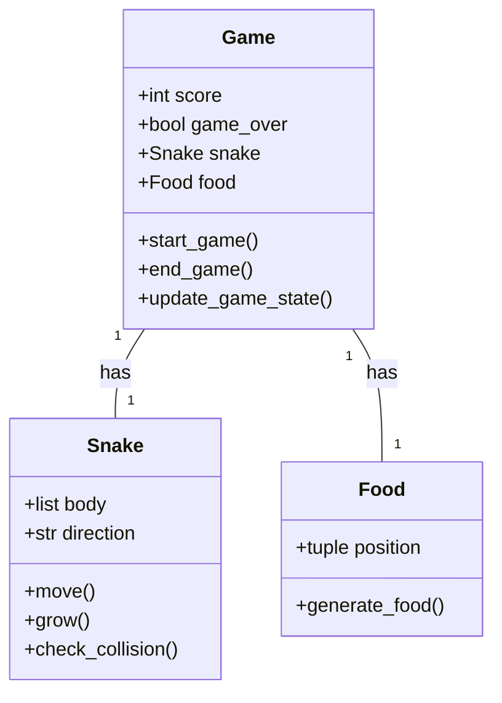
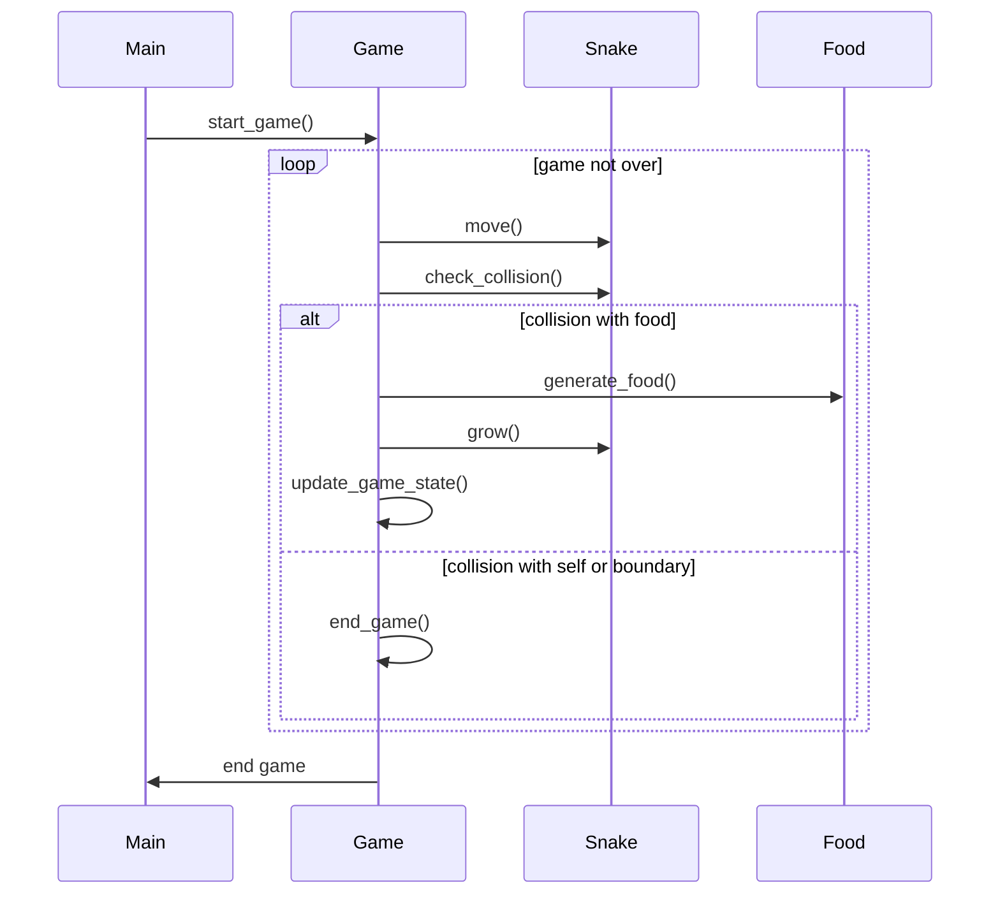

## Implementation approach
The game will be implemented using the Pygame library, an open-source module for Python that is designed for video game creation. The game will be a simple, single-player game where the player controls a snake to eat food. As the snake eats food, it grows longer and the game becomes more challenging. The game ends when the snake collides with the game boundary or with itself.

The main challenges in implementing this game include handling user input for snake movement, detecting collision with the food or with the snake itself, and updating the game state and user interface in real-time.

## Python package name
```python
"snake_game_py"
```

## File list
```python
[
    "main.py",
    "game.py",
    "snake.py",
    "food.py"
]
```

## Data structures and interface definitions


## Program call flow


## Anything UNCLEAR
The requirement is clear to me.