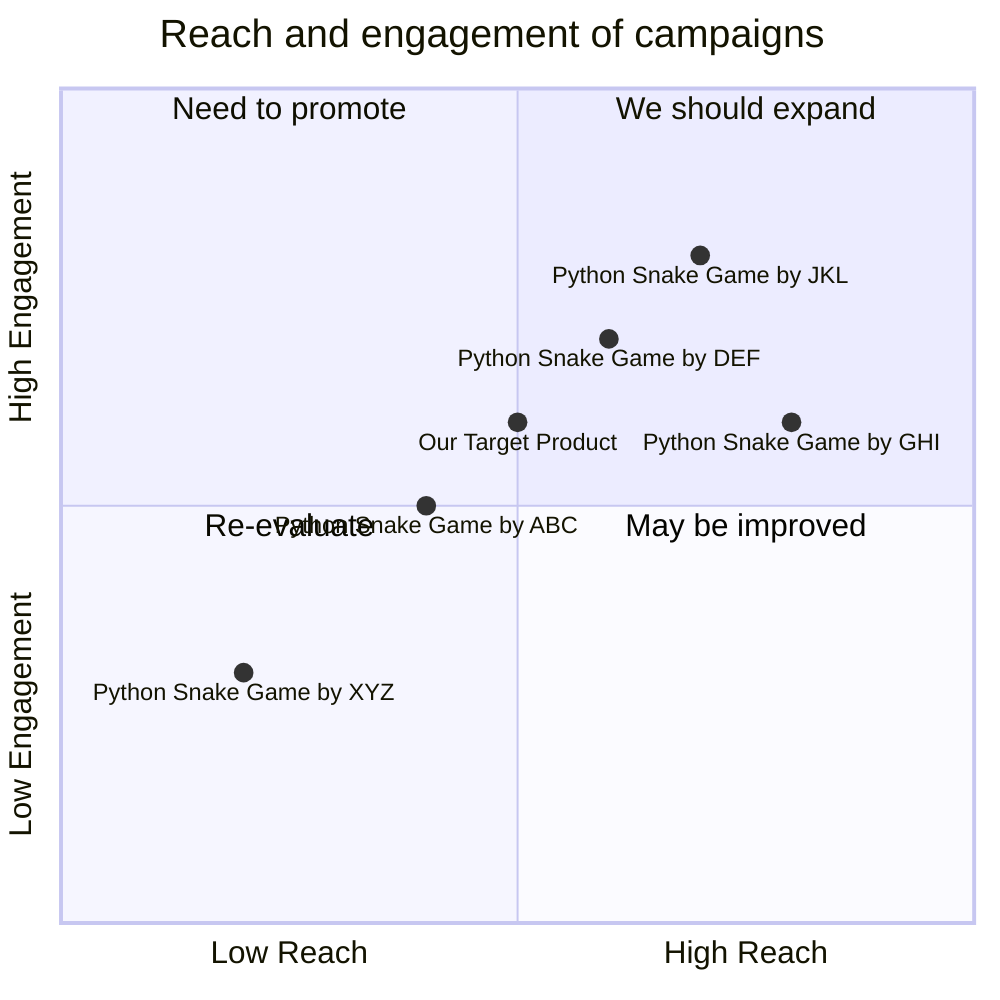

## Original Requirements
The boss has instructed to design the software of a fun snake game in Python. The code for the game should be written by an engineer.

## Product Goals
```python
[
    "Create a fun and engaging snake game",
    "Ensure the game is easy to understand and play",
    "Ensure the game is coded efficiently in Python"
]
```

## User Stories
```python
[
    "As a user, I want to easily start a new game so I can play whenever I want",
    "As a user, I want the game to be challenging so that I can improve my skills",
    "As a user, I want to be able to pause and resume the game so I can take breaks",
    "As a user, I want to see my high score so I can track my progress",
    "As a user, I want the game to run smoothly without any lag"
]
```

## Competitive Analysis
```python
[
    "Python Snake Game by XYZ: Simple design, lacks advanced features",
    "Python Snake Game by ABC: Offers multiple difficulty levels, but has performance issues",
    "Python Snake Game by DEF: Has a variety of game modes, but the interface is not user-friendly",
    "Python Snake Game by GHI: Has a modern design, but the game is not challenging enough",
    "Python Snake Game by JKL: Offers online multiplayer, but the game is too complex for beginners"
]
```

## Competitive Quadrant Chart


## Requirement Analysis
The product should be a fun and engaging snake game. It should be easy to understand and play. The game should be challenging and allow the user to track their progress. It should be possible to pause and resume the game. The game should run smoothly without any lag. The game should be coded efficiently in Python.

## Requirement Pool
```python
[
    ("Design the game to be easy to understand and play", "P0"),
    ("Add a feature to track high scores", "P1"),
    ("Ensure the game runs smoothly without any lag", "P0"),
    ("Add a feature to pause and resume the game", "P1"),
    ("Code the game efficiently in Python", "P0")
]
```

## UI Design draft
The game will have a simple and clean interface. It will have a start button to begin a new game, a pause button to pause the game, and a resume button to resume the game. The high score will be displayed at the top of the screen. The snake and the food will be clearly distinguishable.

## Anything UNCLEAR
There are no unclear points.