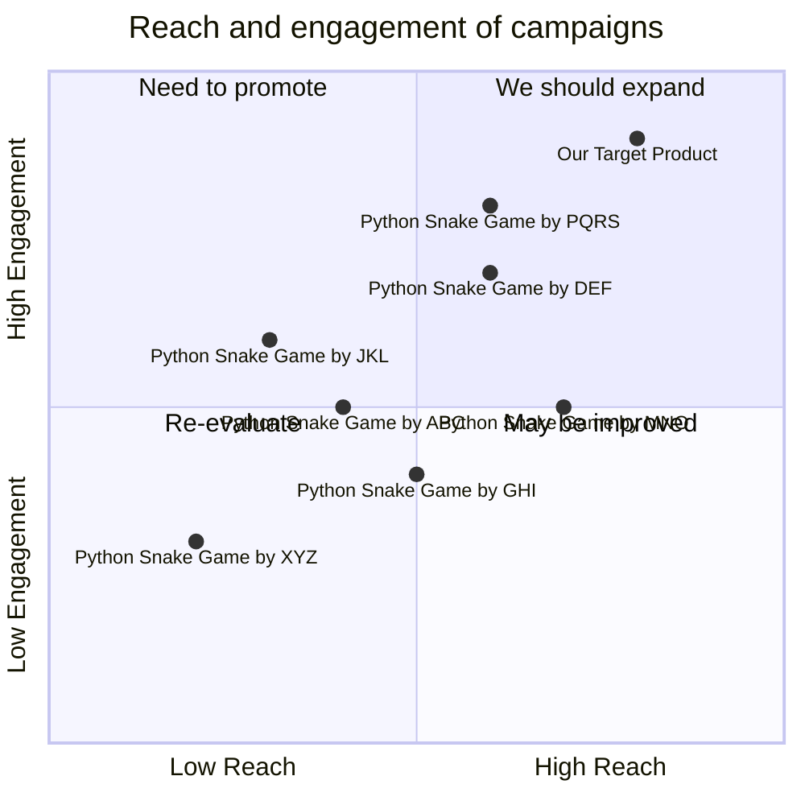

## Original Requirements
The boss has tasked me with designing the software for a fun snake game in Python. The code should be written by an engineer.

## Product Goals
```python
[
    "Create a simple, fun, and engaging snake game using Python",
    "Ensure the game is easy to understand and play",
    "Design the game to be visually appealing and intuitive"
]
```

## User Stories
```python
[
    "As a user, I want to be able to easily start a new game so that I can play whenever I want",
    "As a user, I want the game to have simple and intuitive controls so that I can play without confusion",
    "As a user, I want the game to progressively get harder as I play so that I am constantly challenged",
    "As a user, I want to be able to see my high score so that I can track my progress and aim to beat it",
    "As a user, I want the game to have a visually appealing interface so that my gaming experience is enjoyable"
]
```

## Competitive Analysis
```python
[
    "Python Snake Game by XYZ: A simple snake game with basic functionality but lacks visual appeal",
    "Python Snake Game by ABC: A visually appealing game with complex controls that may confuse new players",
    "Python Snake Game by DEF: A game with a good balance of visual appeal and functionality but lacks progressive difficulty",
    "Python Snake Game by GHI: A game with progressive difficulty but lacks a high score tracking feature",
    "Python Snake Game by JKL: A game with a high score tracking feature but lacks visual appeal",
    "Python Snake Game by MNO: A game with an intuitive interface but lacks progressive difficulty",
    "Python Snake Game by PQRS: A game with a visually appealing interface and simple controls but lacks a high score tracking feature"
]
```

## Competitive Quadrant Chart


## Requirement Analysis
The product should be a simple, fun, and engaging snake game designed in Python. It should have an intuitive interface, easy controls, a high score tracking feature, and a progressive difficulty level to keep the players engaged and challenged.

## Requirement Pool
```python
[
    ("Design a simple and intuitive interface for the game", "P0"),
    ("Implement easy controls for the snake", "P0"),
    ("Include a feature to track the high score", "P1"),
    ("Design the game to progressively get harder as the player continues to play", "P1"),
    ("Ensure the game is visually appealing", "P2")
]
```

## UI Design draft
The game should have a simple and clean interface. The game area should be clearly defined and the snake should be easily distinguishable. The controls should be displayed on the screen for easy reference. The high score should be displayed at a prominent place on the screen. The game should have a modern and minimalistic design with a pleasing color scheme.

## Anything UNCLEAR
There are no unclear points.