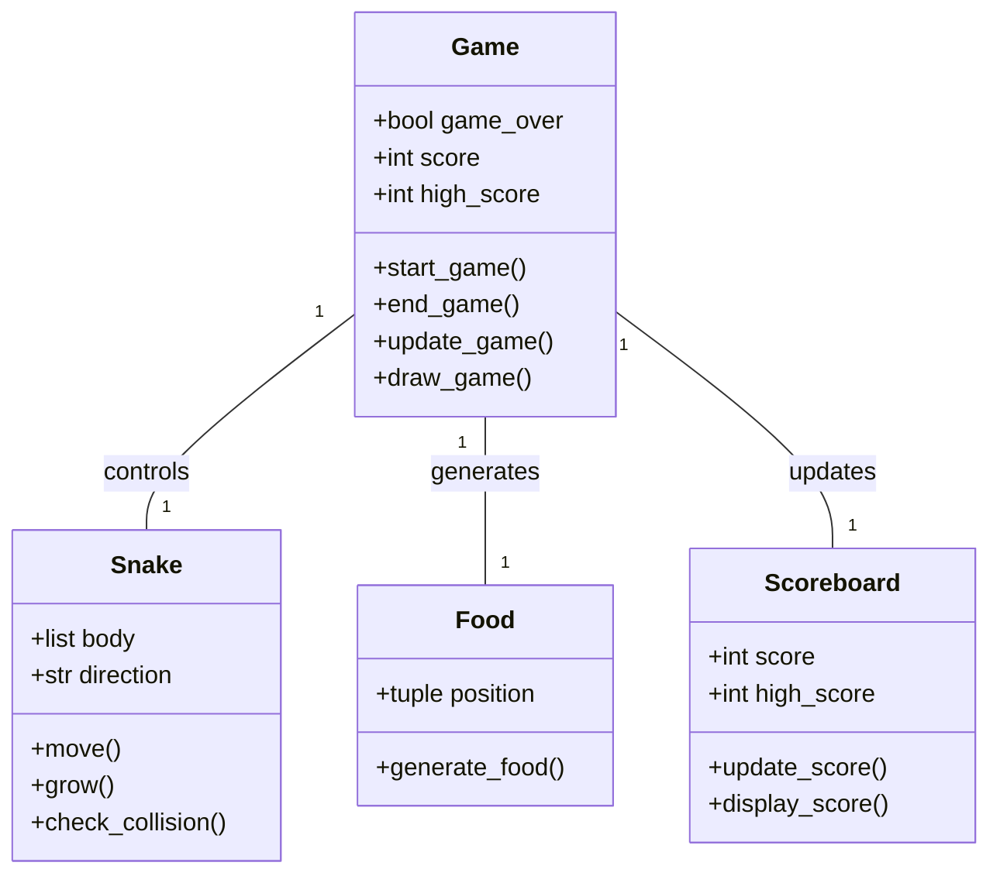
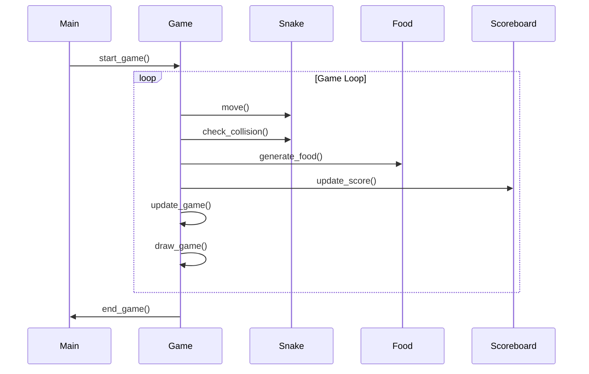

## Implementation approach
We will use the Pygame library, an open-source module for Python, to develop this game. Pygame is a set of Python modules designed for writing video games and provides functionalities for game development such as handling user inputs, drawing shapes and images on the screen, and managing the game loop.

The game will have a main loop that will handle the game logic, user inputs, and rendering. The game logic will include the movement of the snake, collision detection with the food and the boundaries, and the increasing difficulty level. The user inputs will be handled using Pygame's event system. The rendering will be done using Pygame's drawing functions.

The game's difficulty will increase progressively by increasing the speed of the snake as the player's score increases. The high score will be tracked and saved using Python's built-in file handling functions.

## Python package name
```python
"snake_game_pygame"
```

## File list
```python
[
    "main.py",
    "game.py",
    "snake.py",
    "food.py",
    "scoreboard.py"
]
```

## Data structures and interface definitions


## Program call flow


## Anything UNCLEAR
The requirement is clear to me.